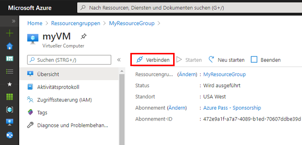
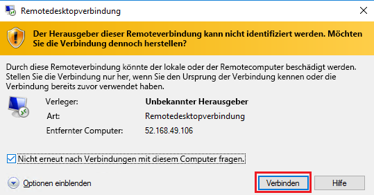
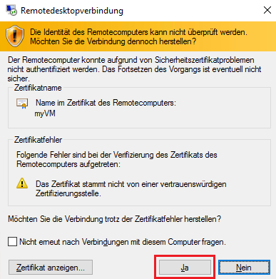
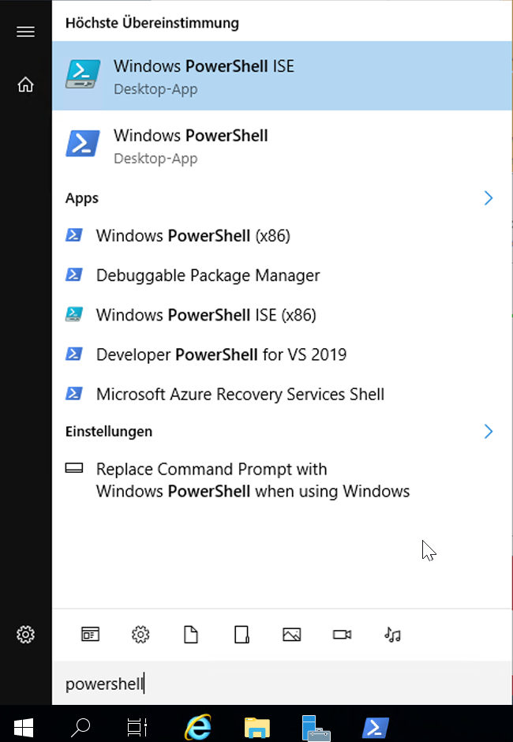
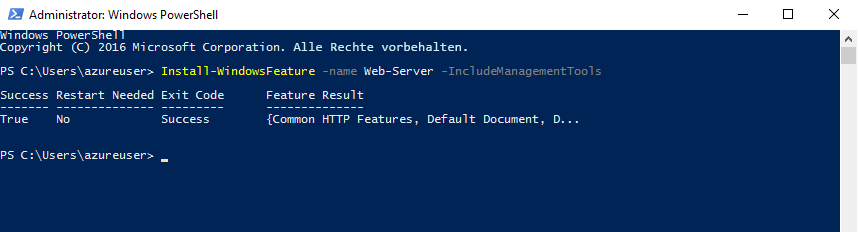
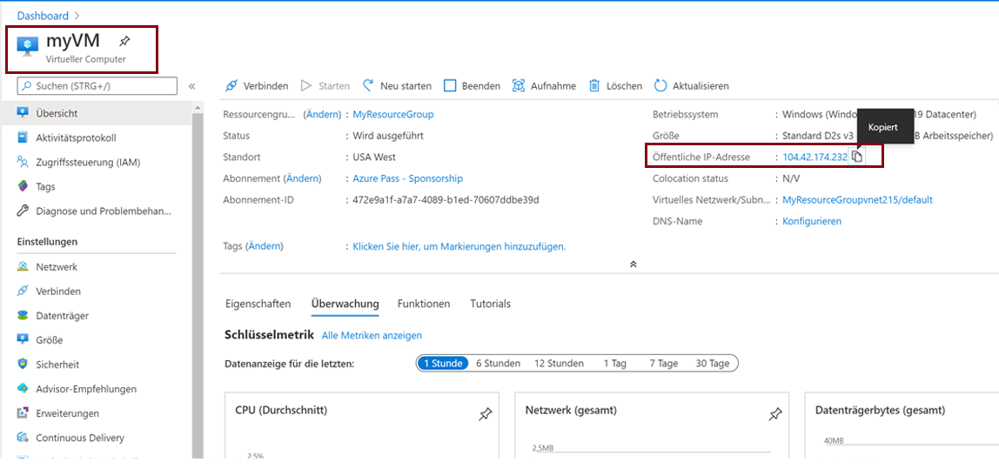
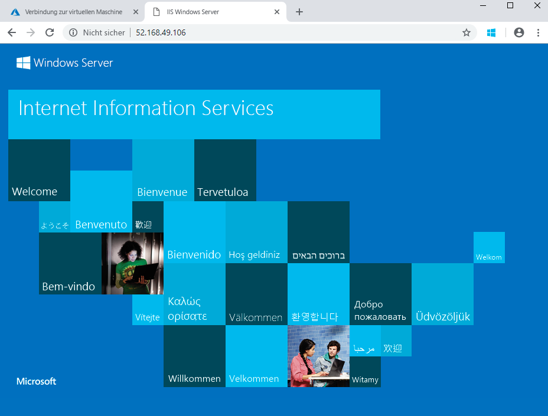

---
wts:
    title: '01 – Erstellen eines virtuellen Computers im Portal (10 Min.)'
    module: 'Modul 02 – Core Azure Services (Workloads)'
---
# 01 – Erstellen Sie einen virtuellen Computer im Portal (10 Min.)

In dieser exemplarischen Vorgehensweise erstellen wir einen virtuellen Computer im Azure-Portal, stellen eine Verbindung zum virtuellen Computer her, installieren die Webserverrolle und testen dann. 

**HINWEIS**: Nehmen Sie sich bei dieser exemplarischen Vorgehensweise die Zeit, auf die Informationssymbole zu klicken und diese zu lesen. 

# Aufgabe 1: Den virtuellen Computer erstellen 
1. Melden Sie sich beim Azure-Portal an: **https://portal.azure.com**

3. Suchen Sie auf dem Blatt **Alle Dienste** im Portalmenü nach **Virtuelle Computer**, und wählen Sie diese Option aus. Klicken Sie dann auf **+ Hinzufügen, +Erstellen, +Neu**, und wählen Sie **+Virtueller Computer** im Dropdownfeld aus.

4. Geben Sie auf der Registerkarte **Grundlagen** die folgenden Informationen ein (belassen Sie ansonsten die Standardeinstellungen):

    | Einstellungen | Werte |
    |  -- | -- |
    | Abonnement | **Standardwert verwenden** |
    | Ressourcengruppe | **Erstellen einer neuen Ressourcengruppe** |
    | Name des virtuellen Computers | **myVM** |
    | Region | **(USA) USA, Osten**|
    | Verfügbarkeitsoptionen | Keine Optionen für die Infrastrukturredundanz erforderlich|
    | Image | **Windows Server 2019 Datacenter - Gen2**|
    | Größe | **Standard D2s v3**|
    | Benutzername des Administratorkontos | **azureuser** |
    | Kennwort für das Administratorkonto (sorgfältig eingeben!) | **Pa$$w0rd1234**|
    | Regeln für eingehende Ports – | **Ausgewählte Ports zulassen**|
    | Eingangsports auswählen | **RDP (3389)** und **HTTP (80)**| 

5. Wechseln Sie zur Registerkarte „Netzwerk“, und stellen Sie sicher, dass **HTTP (80) und RDP (3389)** im Abschnitt **Eingangsports auswählen** ausgewählt sind.

6. Wechseln Sie zur Registerkarte „Verwaltung“, und wählen Sie im Abschnitt **Überwachung** die folgende Einstellung aus:

    | Einstellungen | Werte |
    | -- | -- |
    | Startdiagnose | **Deaktivieren**|

7. Belassen Sie für die restlichen Werte die Standardeinstellungen, und klicken Sie dann auf die Schaltfläche **Überprüfen + erstellen** am unteren Rand der Seite.

8. Sobald die Validierung bestanden ist, klicken Sie auf die Schaltfläche **Erstellen**. Die Bereitstellung des virtuellen Computers kann zwischen fünf und sieben Minuten dauern.

9. Sie erhalten Aktualisierungen auf der Bereitstellungsseite und im Bereich **Benachrichtigungen** (Glockensymbol in der oberen Menüleiste).

# Aufgabe 2: Herstellen der Verbindung zum virtuellen Computer

In dieser Aufgabe verbinden wir uns per RDP (Remotedesktopprotokoll) mit dem virtuellen Computer. 

1. Klicken Sie oben in der blauen Symbolleiste auf das Glockensymbol, und wählen Sie „Zu Ressource wechseln“ aus, nachdem die Bereitstellung erfolgreich abgeschlossen wurde. 

    **HINWEIS**: Sie können auch den Link **Zu Ressource wechseln** auf der Bereitstellungsseite verwenden. 

2. Klicken Sie auf dem Blatt **Überblick** des virtuellen Computers auf die Schaltfläche **Verbinden**, und wählen Sie **RDP** im Dropdownfeld aus.

    

    **HINWEIS**: In den folgenden Anweisungen erfahren Sie, wie Sie von einem Windows-Computer aus eine Verbindung zu Ihrem virtuellen Computer herstellen. Auf einem Mac benötigen Sie einen RDP-Client wie diesen Remotedesktopclient aus dem Mac App Store. Auf einem Linux-Computer können Sie einen Open-Source-RDP-Client verwenden.

2. Übernehmen Sie auf der Seite **Verbindung mit virtuellem Computer herstellen** die Standardoptionen, um sich mit der öffentlichen IP-Adresse und Port 3389 zu verbinden. Klicken Sie dann auf **RDP-Datei herunterladen**. Unten links auf Ihrem Bildschirm wird eine Datei heruntergeladen.

3. **Öffnen** Sie die heruntergeladene RDP-Datei (links unten auf Ihrem Lab-Computer), und klicken Sie auf **Verbinden**, wenn Sie dazu aufgefordert werden. 

    

4. Melden Sie sich im Fenster **Windows-Sicherheit** mit den Administratoranmeldeinformationen an, die Sie verwendet haben, als Sie die VM **azureuser** und das Kennwort **Pa$$w0rd1234** erstellt haben. 

5. Möglicherweise erhalten Sie beim Anmeldevorgang eine Zertifikatwarnung. Klicken Sie auf **Ja**, um die Verbindung herzustellen und eine Verbindung zu Ihrem bereitgestellten virtuellen Computer herzustellen. Die Verbindung sollte erfolgreich hergestellt werden.

    

Ein neuer virtueller Computer (myVM) wird in Ihrem Lab gestartet. Schließen Sie den Server-Manager und die geöffneten Dashboard-Fenster (klicken Sie dazu oben rechts auf das „x“). Jetzt sollten Sie den blauen Hintergrund Ihres virtuellen Computers sehen. **Herzlichen Glückwunsch!** Sie haben einen virtuellen Computer mit Windows Server bereitgestellt und sich mit ihm verbunden. 

# Aufgabe 3: Installieren und Testen der Webserverrolle

In dieser Aufgabe installieren Sie die Webserverrolle auf dem Server in dem soeben erstellten virtuellen Computer, und vergewissern sich, dass die standardmäßige IIS-Willkommensseite angezeigt wird. 

1. Starten Sie PowerShell auf dem soeben bereitgestellten virtuellen Computer, indem Sie in der Suchleiste nach **PowerShell** suchen, mit der rechten Maustaste auf **Windows PowerShell** klicken und **Als Administrator ausführen** auswählen.

    

2. Installieren Sie das Feature **Webserver** in PowerShell auf dem virtuellen Computer, indem Sie den folgenden Befehl ausführen. (Kopieren Sie den Befehl ein und drücken Sie auf die EINGABETASTE, um mit der Installation zu beginnen.)

    ```PowerShell
    Install-WindowsFeature -name Web-Server -IncludeManagementTools
    ```
  
3. Nach Abschluss wird eine **Erfolgsmeldung** mit dem Wert **Wahr** angezeigt. Sie müssen den virtuellen Computer nicht neu starten, um die Installation abzuschließen. Schließen Sie die RDP-Verbindung zur VM, indem Sie auf das **x** in der blauen Leiste oben in der Mitte Ihres virtuellen Computers klicken. Sie können die VM auch minimieren, indem Sie auf das **-** in der blauen Leiste oben in der Mitte klicken.

    

4. Wechseln Sie zurück zum Portal, navigieren Sie zurück zum Blatt **Übersicht** für „myVM“, und verwenden Sie die Schaltfläche **In Zwischenablage kopieren**, um die öffentliche IP-Adresse von „myVM“ zu kopieren. Öffnen Sie dann eine neue Browserregisterkarte, fügen Sie die öffentliche IP-Adresse in das URL-Textfeld ein, und drücken Sie die **Eingabetaste**, um die Adresse zu öffnen.

    

5. Die standardmäßige Willkommensseite des IIS-Webservers wird angezeigt.

    

**Herzlichen Glückwunsch!** Sie haben eine neue VM auf einem Webserver erstellt, die über dessen öffentliche IP-Adresse erreichbar ist. Wenn Sie eine Webanwendung hosten müssen, können Sie Anwendungsdateien auf dem virtuellen Computer bereitstellen und sie für öffentlichen Zugriff auf dem bereitgestellten virtuellen Computer hosten.


**HINWEIS**: Um zusätzliche Kosten zu vermeiden, können Sie diese Ressourcengruppe bei Bedarf entfernen. Suchen Sie nach Ressourcengruppen, klicken Sie auf Ihre Ressourcengruppe und dann auf **Ressourcengruppe löschen**. Überprüfen Sie den Namen der Ressourcengruppe, und klicken Sie dann auf **Löschen**. Überwachen Sie die **Benachrichtigungen**, um zu sehen, wie der Löschvorgang abläuft. 
