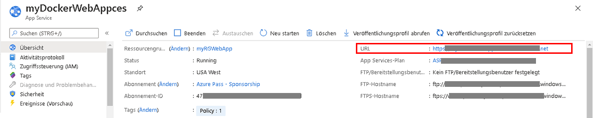
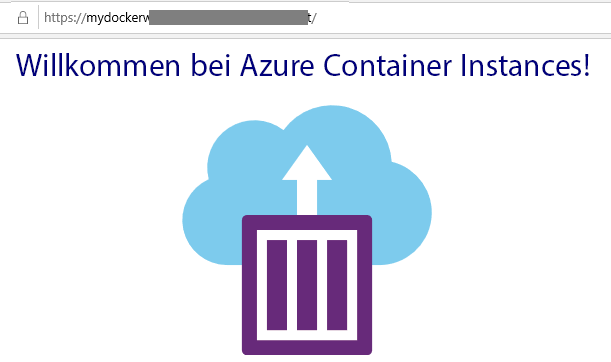

---
wts:
  title: 02 – Erstellen einer Web-App (10 Min.)
  module: Module 02 - Core Azure Services (Workloads)
---
# 02 – Erstellen einer Web-App (10 Min.)

In this walkthrough, we will create a web app that runs a Docker container. The Docker container contains a Welcome message. 

Azure App Service are actually a collection of four services, all of which are built to help you host and run web applications. The four services (Web Apps, Mobile Apps, API Apps, and Logic Apps) look different, but in the end they all operate in very similar ways. Web Apps are the most commonly used of the four services, and this is the service that we will be using in this lab.

# Aufgabe 1: Erstellen einer Web-App 

In dieser Aufgabe erstellen Sie eine Azure App Service-Web-App. 

1. Melden Sie sich beim [Azure-Portal](http://portal.azure.com/)an. 

2. Suchen Sie auf dem Blatt **Alle Dienste** den Eintrag **App Services**, wählen Sie ihn aus, und klicken Sie auf **+ Hinzufügen, + Erstellen, + Neu**.

3. On the <bpt id="p1">**</bpt>Basics<ept id="p1">**</ept> tab of the <bpt id="p2">**</bpt>Web App<ept id="p2">**</ept> blade, specify the following settings (replace <bpt id="p3">**</bpt>xxxx<ept id="p3">**</ept> in the name of the web app with letters and digits such that the name is globally unique). Leave the defaults for everything else, including the App Service Plan. 

    | Einstellung | Wert |
    | -- | -- |
    | Subscription | **Standarddaten verwenden** |
    | Ressourcengruppe | **Neue Ressourcengruppe erstellen**|
    | Name | **myDockerWebAppxxxx** |
    | Veröffentlichen | **Docker-Container** |
    | Betriebssystem | **Linux** |
    | Region | **USA, Osten** |
    
    **Hinweis:** Denken Sie daran, **xxxx** so zu ändern, dass der Name Ihrer Web-App eindeutig ist.

4. Klicken Sie auf **Weiter > Docker**, und konfigurieren Sie die Containerinformationen.  

    | Einstellung | Wert |
    | -- | -- |
    | Optionen | **Einzelner Container** |
    | Imagequelle | **Docker Hub** |
    | Zugriffstyp | **Public** |
    | Image und Tag | **mcr.microsoft.com/azuredocs/aci-helloworld** |
    
 **Hinweis:** Der Startupbefehl ist optional und wird in dieser Übung nicht benötigt.

5. Klicken Sie auf **Überprüfen und erstellen** und dann auf **Erstellen**. 

# Aufgabe 2: Testen der Web-App

In dieser Aufgabe testen wir die Web-App.

1. Warten Sie, bis die Web-App bereitgestellt wurde.

2. Klicken Sie in **Benachrichtigungen** auf **Zur Ressource gehen**. 

3. In dieser exemplarischen Vorgehensweise erstellen wir eine Web-App, in der ein Docker-Container ausgeführt wird.

    

4. In a new browser window, paste the URl and press enter. The Welcome to Azure Container Instances! welcome message will be displayed.

    

5. Azure App Service ist eine Sammlung von vier Diensten, die zum Hosten und Ausführen von Webanwendungen dienen. 

Die vier Dienste (Web-Apps, Mobile Apps, API-Apps und Logic Apps) sehen unterschiedlich aus, funktionieren jedoch letztendlich alle sehr ähnlich.

Herzlichen Glückwunsch! Sie haben erfolgreich einen Azure App Service erstellt.
