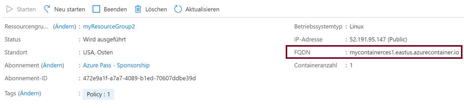
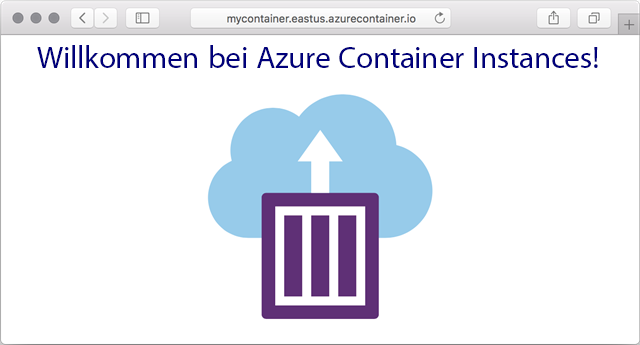

---
wts:
  title: 03 – Bereitstellen von Azure Container Instances (10 Min.)
  module: Module 02 - Core Azure Services (Workloads)
---

# 03 – Bereitstellen von Azure Container Instances (10 Min.)

In this walkthrough we create, configure, and deploy a container by using Azure Container Instances (ACI) in the Azure Portal. The container is a Welcome to ACI web application that displays a static HTML page. 

# Aufgabe 1: Erstellen einer Containerinstanz 

In dieser Aufgabe erstellen wir eine neue Containerinstanz für die Webanwendung.  

1. Melden Sie sich beim [Azure-Portal](https://portal.azure.com) an.

2. Suchen Sie auf dem Blatt **Alle Dienste** den Eintrag **Containerinstanzen**, wählen Sie ihn aus, und klicken Sie auf **+ Hinzufügen, + Erstellen, + Neu**. 

3. Geben Sie die folgenden grundlegenden Details für die neue Containerinstanz an (lassen Sie die restlichen Standardeinstellungen unverändert): 

    | Einstellung| Wert|
    |----|----|
    | Subscription | ***Standarddaten verwenden*** |
    | Resource group | **Neue Ressourcengruppe erstellen** |
    | Containername| **mycontainer**|
    | Region | **(USA) USA, Osten** |
    | Imagequelle| **Docker Hub oder andere Registrierung**|
    | Imagetyp| **Public**|
    | Image| **mcr.microsoft.com/azuredocs/aci-helloworld**|
    | Betriebssystemtyp| **Linux** |
    | Size| ***Standard beibehalten***|

4. Configure the Networking tab (replace <bpt id="p1">**</bpt>xxxxx<ept id="p1">**</ept> with letters and digits such that the name is globally unique). Leave all other settings at their default values.

    | Einstellung| Wert|
    |--|--|
    | DNS-Namensbezeichnung| **mycontainerdnsxxxxx** |

    
    <bpt id="p1">**</bpt>Note<ept id="p1">**</ept>: Your container will be publicly reachable at dns-name-label.region.azurecontainer.io. If you receive a <bpt id="p1">**</bpt>DNS name label not available<ept id="p1">**</ept> error message following the deployment, specify a different DNS name label (replacing the xxxxx) and re-deploy. 

5. Klicken Sie auf **Überprüfen + erstellen**, um die automatische Validierung zu starten.

6. Klicken Sie auf **Erstellen**, um die Containerinstanz zu erstellen. 

7. Überwachen Sie die Bereitstellungsseite und die Seite **Benachrichtigungen**. 

# Aufgabe 2: Überprüfen der Bereitstellung der Containerinstanz

In dieser Aufgabe überprüfen wir, ob die Containerinstanz ausgeführt wird, indem wir sicherstellen, dass die Willkommensseite angezeigt wird.

1. Klicken Sie nach Abschluss der Bereitstellung auf **Zu Ressource wechseln**, verknüpfen Sie das Blatt „Bereitstellung“ oder die Verknüpfung mit der Ressource im Benachrichtigungsbereich.

2. Stellen Sie auf dem Blatt **Überblick** von **mycontainer** sicher, dass der **Status** Ihres Containers **Wird ausgeführt** lautet. 

3. Suchen Sie den vollqualifizierten Domänennamen (Fully Qualified Domain Name, FQDN).

    

2. In dieser exemplarischen Vorgehensweise werden wir einen Container mit Azure Container Instances (ACI) im Azure Portal erstellen, konfigurieren und bereitstellen. 

    

Der Container ist eine Welcome to ACI-Webanwendung, die eine statische HTML-Seite anzeigt.

<bpt id="p1">**</bpt>Note<ept id="p1">**</ept>: To avoid additional costs, you can optionally remove this resource group. Search for resource groups, click your resource group, and then click <bpt id="p1">**</bpt>Delete resource group<ept id="p1">**</ept>. Verify the name of the resource group and then click <bpt id="p1">**</bpt>Delete<ept id="p1">**</ept>. Monitor the <bpt id="p1">**</bpt>Notifications<ept id="p1">**</ept> to see how the delete is proceeding.
