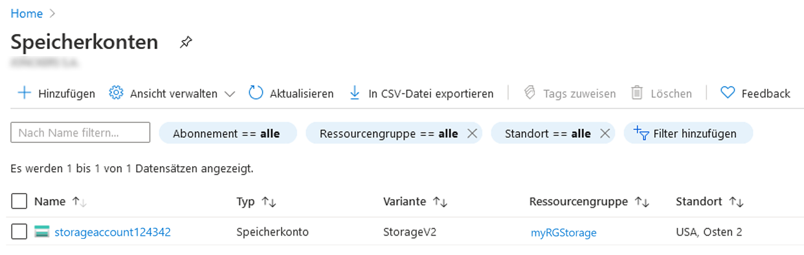
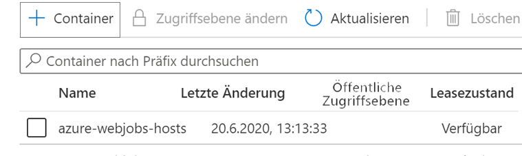

---
wts:
  title: 05 – Blob-Speicher erstellen (5 Min.)
  module: Module 02 - Core Azure Services (Workloads)
---
# 05 – Blob-Speicher erstellen (5 Min.)

In dieser exemplarischen Vorgehensweise erstellen wir ein Speicherkonto und arbeiten dann mit Blob Storage-Dateien.

# Aufgabe 1: Erstellen eines Speicherkontos 

In dieser Aufgabe erstellen wir ein neues Speicherkonto. 

1. Melden Sie sich unter <a href="https://portal.azure.com" target="_blank">https://portal.azure.com</a> beim Azure-Portal an.

2. Suchen Sie auf dem Blatt **Alle Dienste** den Eintrag **Speicherkonten**, wählen Sie ihn aus, und klicken Sie auf **+ Hinzufügen, + Erstellen, + Neu**. 

3. On the <bpt id="p1">**</bpt>Basics<ept id="p1">**</ept> tab of the <bpt id="p2">**</bpt>Create storage account<ept id="p2">**</ept> blade, fill in the following information (replace <bpt id="p3">**</bpt>xxxx<ept id="p3">**</ept> in the name of the storage account with letters and digits such that the name is globally unique). Leave the defaults for everything else.

    | Einstellung | Wert | 
    | --- | --- |
    | Subscription | **Standard beibehalten** |
    | Resource group | **Neue Ressourcengruppe erstellen** |
    | Speicherkontoname | **storageaccountxxxxx** |
    | Standort | **(USA) USA, Osten**  |
    | Leistung | **Standard** |
    | Redundanz | **Lokal redundanter Speicher (LRS)** |
    
    **Hinweis**: Denken Sie daran, **xxxxx** zu ändern, sodass sich ein eindeutiger **Speicherkontoname** ergibt

5. Klicken Sie auf **Überprüfen + erstellen**, um die Einstellungen Ihres Speicherkontos zu überprüfen und Azure die Validierung der Konfiguration zu ermöglichen. 

6. Once validated, click <bpt id="p1">**</bpt>Create<ept id="p1">**</ept>. Wait for the notification that the account was successfully created. 

7. Suchen Sie auf der Homepage die Option **Speicherkonten**, und wählen Sie sie aus. Stellen Sie sicher, dass Ihr neues Speicherkonto aufgeführt ist.

    

# Aufgabe 2: Arbeiten mit Blob-Speicher

In dieser Aufgabe erstellen wir einen Blob-Container und laden eine Blob-Datei hoch. 

1. Klicken Sie auf den Namen des neuen Speicherkontos, scrollen Sie links im Menü zum Abschnitt **Datenspeicherung**, und klicken Sie auf **Container**.

2. Click <bpt id="p1">**</bpt>+ Container<ept id="p1">**</ept> and complete the information. Use the Information icons to learn more. When done click <bpt id="p1">**</bpt>Create<ept id="p1">**</ept>.

    | Einstellung | Wert |
    | --- | --- |
    | Name | **container1**  |
    | Öffentliche Zugriffsebene| **Privat (kein anonymer Zugriff)** |
  

    

4. Open a new browser window and search <bpt id="p1">**</bpt>Bing<ept id="p1">**</ept> for an image of a flower. Right click on the image and save it to your VM. 

6. Wechseln Sie zurück zum Portal, klicken Sie auf **Container1**, und wählen Sie **Hochladen** aus.

5. Browse for the image file you just saved on your local computer. Select it and then select upload.

   
6. Klicken Sie auf den Pfeil **Erweitert**, übernehmen Sie die Standardwerte, überprüfen Sie die verfügbaren Optionen, und klicken Sie dann auf **Hochladen**.

    <bpt id="p1">**</bpt>Note<ept id="p1">**</ept>: You can upload as many blobs as you like in this way. New blobs will be listed within the container.

7. Klicken Sie nach dem Hochladen der Datei mit der rechten Maustaste auf die Datei und beachten Sie die Optionen „Anzeigen/Bearbeiten“, „Herunterladen“, „Eigenschaften“ und „Löschen“. 

8. Wenn Sie Zeit haben, sehen Sie sich die Optionen für Dateien, Tabellen und Warteschlangen an.

# Aufgabe 3: Überwachen des Speicherkontos

1. Kehren Sie zum Blatt „Speicherkonto“ zurück, und klicken Sie auf **Diagnose und Problembehandlung**. 

2. Explore some of the most common storage problems. Notice there are multiple troubleshooters here.

3. On the storage account blade, scroll down to the <bpt id="p1">**</bpt>Monitoring<ept id="p1">**</ept> section and click <bpt id="p2">**</bpt>Insights<ept id="p2">**</ept>. Notice there is information on Failures, Performance, Availability, and Capacity. Your information will be different.

    

Geben Sie auf dem Blatt **Speicherkonto erstellen** auf der Registerkarte **Grundlagen** die folgenden Informationen ein (ersetzen Sie **xxxx** im Speicherkontonamen durch Buchstaben und Ziffern, sodass der Name global eindeutig ist).

Belassen Sie ansonsten die Standardeinstellungen.
