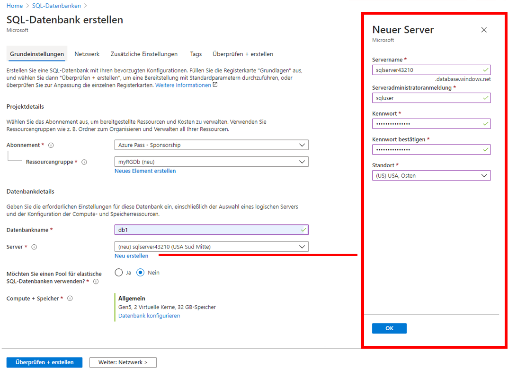
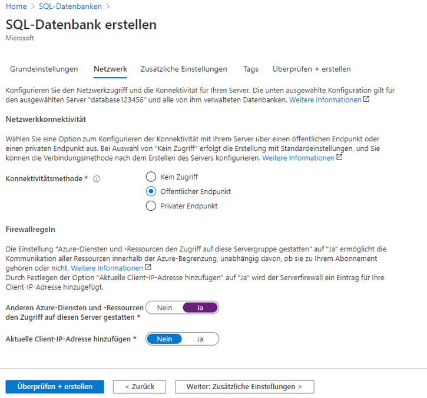
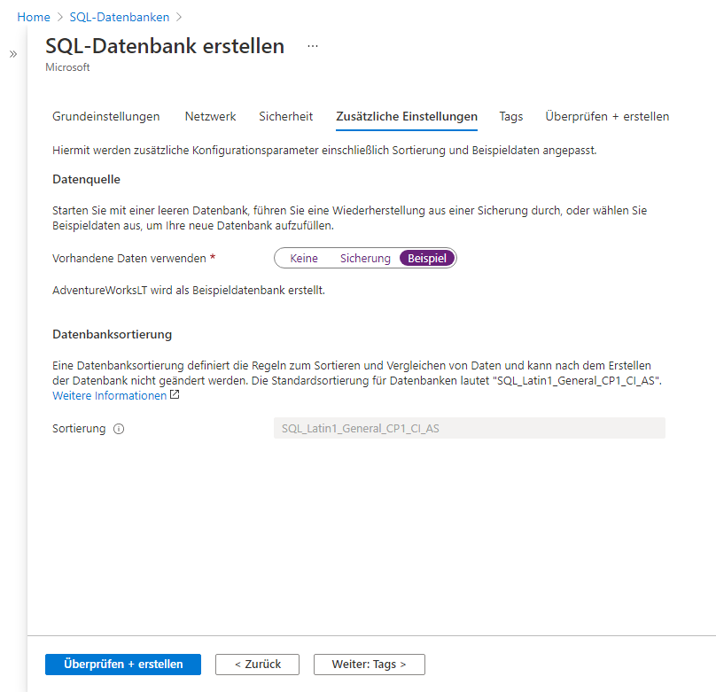
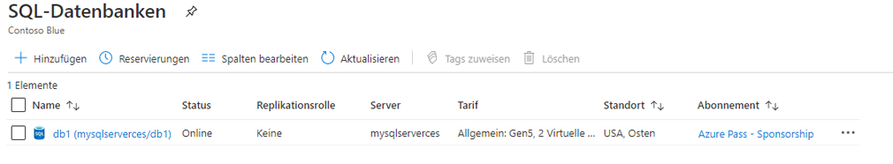
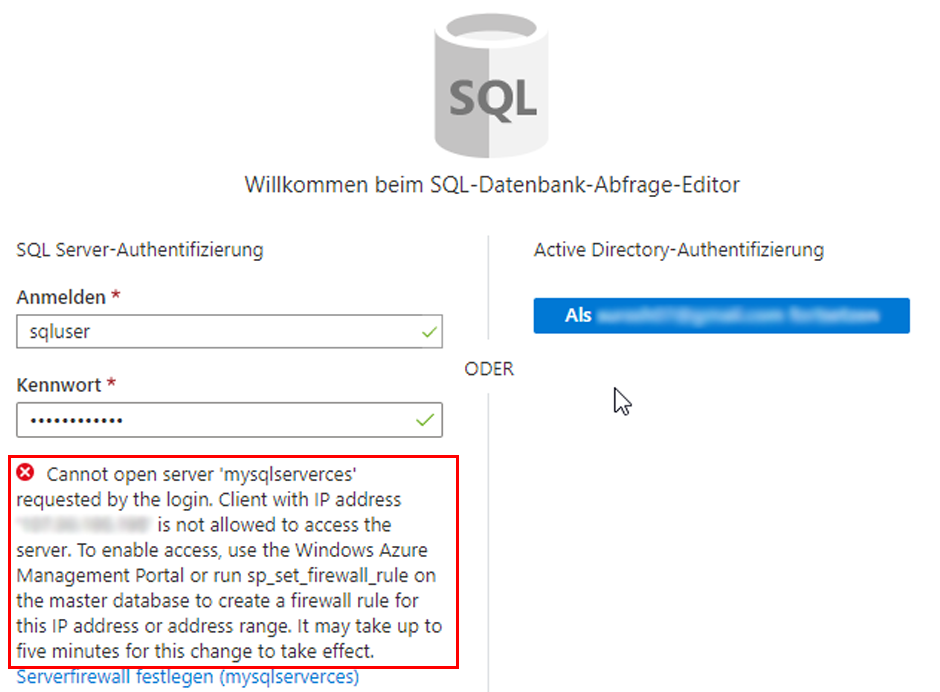
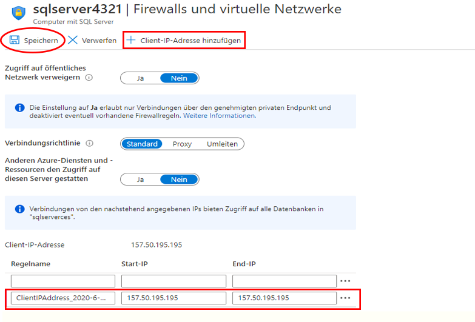

---
wts:
    title: '06 - Erstellen einer SQL-Datenbank (5 Min.)'
    module: 'Modul 02 - Azure-Kerndienste (Workloads)'
---

# 06 – Erstellen einer SQL-Datenbank (5 Min.)

In dieser exemplarischen Vorgehensweise erstellen wir eine SQL-Datenbank in Azure und fragen dann die Daten in dieser Datenbank ab.

# Aufgabe 1: Erstellen der Datenbank 

In dieser Aufgabe werden wir eine SQL-Datenbank auf der Grundlage der AdventureWorksLT-Beispieldatenbank erstellen. 

1. Melden Sie sich beim Azure-Portal an unter [**https://portal.azure.com**](https://portal.azure.com).

2. Suchen Sie auf dem Blatt **Alle Dienste** den Eintrag **SQL-Datenbanken**, wählen Sie ihn aus, und klicken Sie auf **+ Hinzufügen, + Erstellen, + Neu**. 

3. Geben Sie auf der Registerkarte **Grundlagen** diese Informationen ein.  

    | Einstellung | Wert | 
    | --- | --- |
    | Abonnement | **Standardwert verwenden** |
    | Ressourcengruppe | **Erstellen einer neuen Ressourcengruppe** |
    | Datenbankname| **db1** | 
    | Server | Wählen Sie **Neu erstellen** aus (rechts wird eine neue Seitenleiste geöffnet)|
    | Servername | **sqlserverxxxx** (muss eindeutig sein) | 
    | Standort | **(USA) USA, Osten** |
    | Authentifizierungsmethode | **SQL-Authentifizierung verwenden** |
    | Serveradministratoranmeldung | **sqluser** |
    | Kennwort | **Pa$$w0rd1234** |
    | Klicken Sie auf  | **OK** |

   

4. Konfigurieren Sie auf der Registerkarte **Netzwerk** die folgenden Einstellungen (behalten Sie für die restlichen Einstellungen die Standardwerte bei): 

    | Einstellung | Wert | 
    | --- | --- |
    | Konnektivitätsmethode | **Öffentlicher Endpunkt** |    
    | Ermöglichen Sie Azure-Diensten und -Ressourcen den Zugriff auf diesen Server | **Ja** |
    | Aktuelle Client-IP-Adresse hinzufügen | **Nein** |
    
   

5. Auf der Registerkarte **Sicherheit**. 

    | Einstellung | Wert | 
    | --- | --- |
    | Microsoft Defender für SQL| **Nicht jetzt** |
    
6. Wechseln Sie in die Registerkarte **Zusätzliche Einstellungen**. Wir werden die AdventureWorksLT-Beispieldatenbank verwenden.

    | Einstellung | Wert | 
    | --- | --- |
    | Vorhandene Daten verwenden | **Stichprobe** |

    

7. Klicken Sie auf **Überprüfen + erstellen** und dann auf **Erstellen**, um die Ressourcengruppe, den Server und die Datenbank bereitzustellen. Die Bereitstellung kann etwa 2 bis 5 Minuten dauern.


# Aufgabe 2: Testen der Datenbank

In dieser Aufgabe konfigurieren wir den SQL Server und führen eine SQL-Abfrage aus. 

1. Warten Sie, bis die Bereitstellung abgeschlossen wurde, und klicken Sie auf dem Blatt „Bereitstellung“ auf „Zur Ressource wechseln“. Alternativ können Sie auf dem Blatt **Alle Ressourcen** den Eintrag **Datenbanken** suchen und auswählen und dann **SQL-Datenbanken** auswählen, um sicherzustellen, dass Ihre neue Datenbank erstellt wurde. Möglicherweise müssen Sie die Seite **Aktualisieren**.

    

2. Klicken Sie auf den Eintrag **db1** für die soeben erstellte SQL-Datenbank. Klicken Sie auf dem Blatt „db1“ auf **Abfrage-Editor (Vorschau)**.

3. Melden Sie sich als **sqluser** mit dem Kennwort **Pa$$w0rd1234** an.

4. Sie werden sich nicht anmelden können. Lesen Sie den Fehler genau durch und notieren Sie sich die IP-Adresse, die durch die Firewall erlaubt werden muss. 

    

5. Klicken Sie auf dem Blatt **db1** auf **Übersicht**. 

    

6. Klicken Sie auf dem Blatt **Übersicht** für db1 oben in der Mitte des Bildschirms auf **Serverfirewall festlegen**.

7. Klicken Sie auf **+ Client-IP hinzufügen** (obere Menüleiste), um die in der Fehlermeldung angegebene IP-Adresse hinzuzufügen. (Möglicherweise wurde die Adresse automatisch ausgefüllt; falls nicht, fügen Sie sie in die entsprechenden Felder ein) Achten Sie darauf, Ihre Änderungen zu **Speichern**. 

    

8. Kehren Sie zu Ihrer SQL-Datenbank zurück (ziehen Sie den unteren Umschalter nach links), und klicken Sie auf **Abfrage-Editor (Vorschau)**. Versuchen Sie, sich wieder als **sqluser** mit dem Kennwort **Pa$$w0rd1234** anzumelden. Diesmal sollten Sie Erfolg haben. Beachten Sie, dass es einige Minuten dauern kann, bis die neue Firewallregel bereitgestellt wird. 

9. Nachdem Sie sich erfolgreich angemeldet haben, wird der Abfragebereich angezeigt. Geben Sie die folgende Abfrage in den Editor-Bereich ein. 

    ```SQL
    SELECT TOP 20 pc.Name as CategoryName, p.name as ProductName
    FROM SalesLT.ProductCategory pc
    JOIN SalesLT.Product p
    ON pc.productcategoryid = p.productcategoryid;
    ```

    

10. Klicken Sie auf **Ausführen**, und überprüfen Sie dann die Abfrageergebnisse im Bereich **Ergebnisse**. Die Abfrage sollte erfolgreich ausgeführt werden.

    

Herzlichen Glückwunsch! Sie haben eine SQL-Datenbank in Azure erstellt und die Daten in dieser Datenbank erfolgreich abgefragt.

**HINWEIS**: Um zusätzliche Kosten zu vermeiden, können Sie diese Ressourcengruppe bei Bedarf entfernen. Suchen Sie nach Ressourcengruppen, klicken Sie auf Ihre Ressourcengruppe und dann auf **Ressourcengruppe löschen**. Überprüfen Sie den Namen der Ressourcengruppe, und klicken Sie dann auf **Löschen**. Überwachen Sie die **Benachrichtigungen**, um zu sehen, wie der Löschvorgang abläuft.
