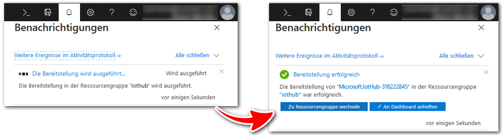
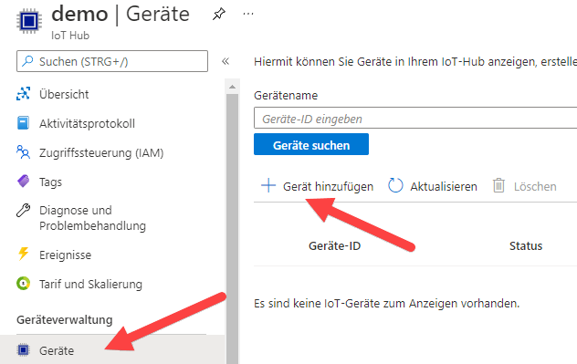
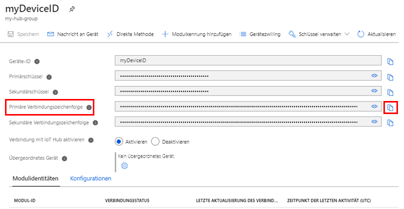
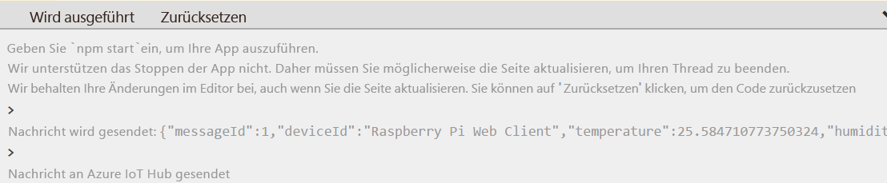
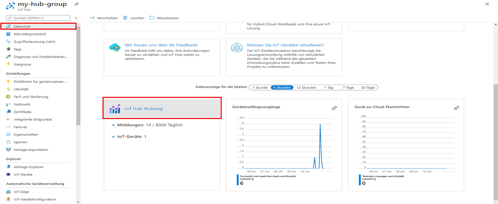

---
wts:
    title: '07 - Implementieren eines Azure IoT Hub (10 Min.)'
    module: 'Modul 03: Kernlösungen und Verwaltungstools beschreiben'
---
# 07 – Implementieren eines Azure IoT Hubs (10 Min.)

In dieser exemplarischen Vorgehensweise konfigurieren wir einen neuen Azure IoT Hub im Azure-Portal und authentifizieren dann eine Verbindung zu einem IoT-Gerät mithilfe des Raspberry Pi-Gerätesimulators. Sensordaten und Nachrichten werden vom Raspberry Pi-Simulator an Ihren Azure IoT Hub übergeben, und Sie sehen Metriken für die Meldungsaktivität im Azure-Portal.

# Aufgabe 1: Erstellen eines IoT-Hubs 

In dieser Aufgabe werden wir einen IoT-Hub erstellen. 

1. Melden Sie sich beim [Azure-Portal](https://portal.azure.com) an.

2. Suchen Sie auf dem Blatt **Alle Dienste** den Eintrag **IoT Hub**, wählen Sie ihn aus, und klicken Sie auf **+ Hinzufügen, + Erstellen, + Neu**.

3. Auf der Registerkarte **Grundlagen** des Blatts **IoT-Hub** füllen Sie die Felder mit den folgenden Details aus (ersetzen Sie **xxxx** im Namen des Speicherkontos durch Buchstaben und Ziffern, sodass der Name global eindeutig ist):

    | Einstellungen | Wert |
    |--|--|
    | Abonnement | **Standardwert beibehalten** |
    | Ressourcengruppe | **Erstellen einer neuen Ressourcengruppe** |
    | IoT Hub-Name | **my-hub-groupxxxxx** |
    | Region | **USA, Osten** |

    **Hinweis** - Denken Sie daran, **xxxxx** so zu ändern, dass sich ein eindeutiger **IoT Hub-Name** ergibt.

4. Wechseln Sie zur Registerkarte **Verwaltung**, und legen Sie im Dropdownfeld für **Preis- und Skalierungsebene** den Wert **S1: Standardebene**.

5. Klicken Sie auf die Schaltfläche **Überprüfen + erstellen**.

6. Klicken Sie auf die Schaltfläche **Erstellen**, um mit der Erstellung Ihrer neuen Azure IoT Hub-Instanz zu beginnen.

7. Warten Sie, bis die Azure IoT Hub-Instanz bereitgestellt ist. 

# Aufgabe 2: Hinzufügen eines IoT-Geräts

In dieser Aufgabe fügen wir dem IoT-Hub ein IoT-Gerät hinzu. 

1. Wenn die Bereitstellung abgeschlossen ist, klicken Sie auf dem Blatt „Bereitstellung“ auf **Zur Ressource wechseln**. Alternativ suchen Sie auf dem Blatt **Alle Dienste** nach **IoT Hub**, wählen diese Option aus und suchen Ihre neue IoT Hub-Instanz

	

2. Um ein neues IoT-Gerät hinzuzufügen, scrollen Sie nach unten zum Abschnitt **Geräteverwaltung**, und klicken Sie auf **Geräte**. Klicken Sie auf **+ Gerät hinzufügen**.

	

3. Geben Sie einen Namen für Ihr neues IoT-Gerät ein ( **myRaspberryPi**), und klicken Sie auf die Schaltfläche **Speichern**. Dadurch wird eine neue IoT-Geräteidentität in Ihrem Azure IoT Hub erstellt.

4. Wenn Sie Ihr neues Gerät nicht sehen, **Aktualisieren** Sie die Seite „IoT-Geräte“. 

5. Wählen Sie **myRaspberryPi** aus, und kopieren Sie den Wert von **Primäre Verbindungszeichenfolge**. Mit diesem Schlüssel werden Sie in der nächsten Aufgabe eine Verbindung zum Raspberry Pi-Simulator authentifizieren.

	

# Aufgabe 3: Testen des Geräts mit einem Raspberry Pi-Simulator

In dieser Aufgabe testen wir unser Gerät mit dem Raspberry Pi-Simulator. 

1. Öffnen Sie eine neue Registerkarte im Webbrowser, und geben Sie den folgenden Abkürzungs-Link ein: https://aka.ms/RaspPi. Daraufhin gelangen sie zur Website des Raspberry Pi-Simulators. Wenn Sie Zeit haben, machen Sie sich mit dem Raspberry Pi-Simulator vertraut. Wenn Sie fertig sind, wählen Sie „**X**“ aus, um das Popupfenster zu schließen.

2. Suchen Sie im Codebereich auf der rechten Seite die Zeile mit „const connectionString =“. Ersetzen Sie dies durch die Verbindungszeichenfolge, die Sie aus dem Azure-Portal kopiert haben. Beachten Sie, dass die Verbindungszeichenfolge die Einträge DeviceId (**myRaspberryPi**) und SharedAccessKey enthält.

	

3. Klicken Sie auf **Ausführen** (unterhalb des Codebereichs), um die Anwendung auszuführen. Die Konsolenausgabe sollte die Sensordaten und Nachrichten anzeigen, die vom Raspberry Pi-Simulator an Ihren Azure IoT Hub gesendet werden. Daten und Nachrichten werden jedes Mal gesendet, wenn die Raspberry Pi-Simulator-LED blinkt. 

	

5. Klicken Sie auf **Beenden**, um das Senden von Daten zu beenden.

6. Wechseln Sie zurück zum Azure-Portal.

7. Wechseln Sie zum Blatt **Übersicht** für das IoT Hub, und scrollen Sie nach unten zu den **IoT Hub-Nutzungsdaten**, um die Nutzung anzuzeigen. Ändern Sie den Zeitraum unter **Daten anzeigen für letzte**, um die Daten für die letzte Stunde anzuzeigen.

	

Herzlichen Glückwunsch! Sie haben Azure IoT Hub so eingerichtet, dass Sensordaten von einem IoT-Gerät erfasst werden.

**HINWEIS**: Um zusätzliche Kosten zu vermeiden, können Sie diese Ressourcengruppe bei Bedarf entfernen. Suchen Sie nach Ressourcengruppen, klicken Sie auf Ihre Ressourcengruppe und dann auf **Ressourcengruppe löschen**. Überprüfen Sie den Namen der Ressourcengruppe, und klicken Sie dann auf **Löschen**. Überwachen Sie die **Benachrichtigungen**, um zu sehen, wie der Löschvorgang abläuft.
