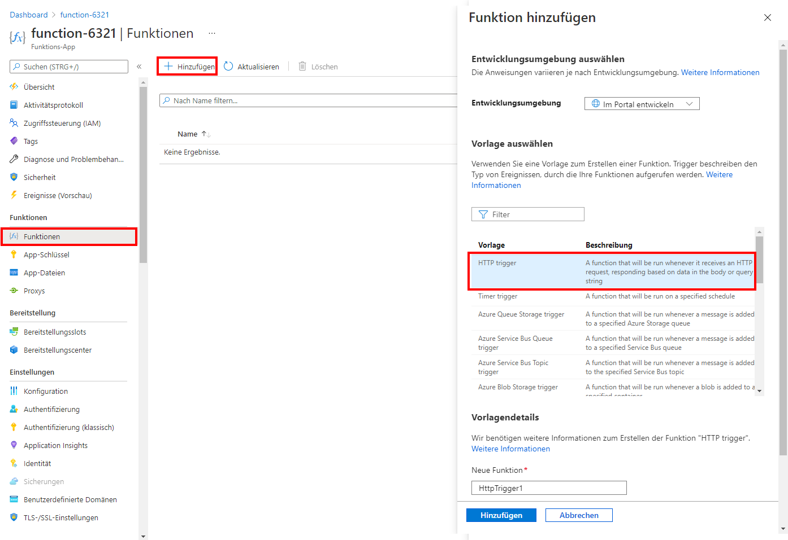

---
wts:
  title: 08 – Implementieren von Azure Functions (5 Min.)
  module: 'Module 03: Describe core solutions and management tools'
---
# 08 – Implementieren von Azure Functions (5 Min.)

In dieser exemplarischen Vorgehensweise erstellen wir eine Funktions-App, um eine Hallo-Meldung anzuzeigen, wenn eine HTTP-Anforderung vorliegt. 

# Aufgabe 1: Eine Funktions-App erstellen 

In dieser Aufgabe erstellen wir eine Funktions-App.

1. Melden Sie sich beim [Azure-Portal](https://portal.azure.com) an.

2. Wählen Sie in der **Suchleiste** oben im Portal **Funktions-App** aus, und klicken Sie dann auf dem Blatt **Funktions-App** auf **+ Hinzufügen, + Erstellen, + Neu**.

3. Geben Sie auf dem Blatt **Funktions-App** auf der Registerkarte **Basic** die folgenden Einstellungen an (ersetzen Sie **xxxx** im Funktionsnamen durch Buchstaben und Ziffern, sodass der Name global eindeutig ist, und belassen Sie für alle anderen Einstellungen die Standardwerte): 

    | Einstellungen | Wert |
    | -- | --|
    | Subscription | **Standarddaten beibehalten** |
    | Resource group | **Neue Ressourcengruppe erstellen** |
    | Name der Funktions-App | **function-xxxx** |
    | Veröffentlichen | **Code** |
    | Laufzeitstapel | **.NET** |
    | Version | **3.1** |
    | Region | **USA, Osten** |

    **Hinweis** – Denken Sie daran, **xxxx** zu ändern, sodass sich ein eindeutiger **Funktions-App-Name** ergibt

4. Klicken Sie auf **Überprüfen + erstellen**. Klicken Sie nach erfolgreicher Validierung auf **Erstellen**, um mit der Bereitstellung Ihrer neuen Azure Funktions-App zu beginnen.

5. Warten Sie auf die Benachrichtigung, dass die Ressource erstellt wurde.

6. When the deployment has completed, click Go to resource from the deployment blade. Alternatively, navigate back to the <bpt id="p1">**</bpt>Function App<ept id="p1">**</ept> blade, click <bpt id="p2">**</bpt>Refresh<ept id="p2">**</ept> and verify that the newly created function app has the <bpt id="p3">**</bpt>Running<ept id="p3">**</ept> status. 

    

# Aufgabe 2: Erstellen und Testen einer durch HTTP ausgelöste Funktion

In dieser Aufgabe verwenden wir die Webhook + API-Funktion, um eine Nachricht anzuzeigen, wenn eine HTTP-Anforderung vorliegt. 

1. Klicken Sie auf dem Blatt **Funktions-App** auf die neu erstellte Funktions-App. 

2. Klicken Sie auf dem Blatt „Funktions-App“ im Abschnitt **Funktionen** auf **Funktionen** und dann auf **+ Hinzufügen, + Erstellen, + Neu**.

    

3. An <bpt id="p1">**</bpt>Add function<ept id="p1">**</ept> pop-up window will appear on the right. In the <bpt id="p1">**</bpt>Select a template<ept id="p1">**</ept> section click <bpt id="p2">**</bpt>HTTP trigger<ept id="p2">**</ept>. Click <bpt id="p1">**</bpt>Add<ept id="p1">**</ept> 

    

4. Klicken Sie auf dem Blatt **HttpTrigger1** im Abschnitt **Entwickler** auf **Code + Test**. 

5. On the <bpt id="p1">**</bpt>Code + Test<ept id="p1">**</ept> blade, review the auto-generated code and note that the code is designed to run an HTTP request and log information. Also, notice the function returns a Hello message with a name. 

    

6. Klicken Sie auf **Funktions-URL abrufen** im oberen Abschnitt des Funktions-Editors. 

7. Stellen Sie sicher, dass der Wert in der Dropdownliste **Schlüssel** auf **Standard** gesetzt ist, und klicken Sie auf **Kopieren**, um die Funktions-URL zu kopieren. 

    

8. Open a new browser tab and paste the copied function URL into your web browser's address bar. When the page is requested the function will run. Notice the returned message stating that the function requires a name in the request body.

    

9. Fügen Sie **&name=*Ihr Name*** am Ende der URL an.

    **Hinweis:** Wenn Ihr Name beispielsweise „Cindy“ lautet, sieht die endgültige URL wie folgt aus: `https://azfuncxxx.azurewebsites.net/api/HttpTrigger1?code=X9xx9999xXXXXX9x9xxxXX==&name=cindy`

    

10. When you hit enter, your function runs and every invocation is traced. To view the traces, return to the Portal <bpt id="p1">**</bpt>HttpTrigger1 <ph id="ph1">\|</ph> Code + Test<ept id="p1">**</ept> blade and click <bpt id="p2">**</bpt>Monitor<ept id="p2">**</ept>. You can <bpt id="p1">**</bpt>configure<ept id="p1">**</ept> Application Insights by selecting the timestamp and click <bpt id="p2">**</bpt>Run query in Application Insights<ept id="p2">**</ept>.

     

Congratulations! You have created a Function App to display a Hello message when there is an HTTP request.  

<bpt id="p1">**</bpt>Note<ept id="p1">**</ept>: To avoid additional costs, you can optionally remove this resource group. Search for resource groups, click your resource group, and then click <bpt id="p1">**</bpt>Delete resource group<ept id="p1">**</ept>. Verify the name of the resource group and then click <bpt id="p1">**</bpt>Delete<ept id="p1">**</ept>. Monitor the <bpt id="p1">**</bpt>Notifications<ept id="p1">**</ept> to see how the delete is proceeding.
