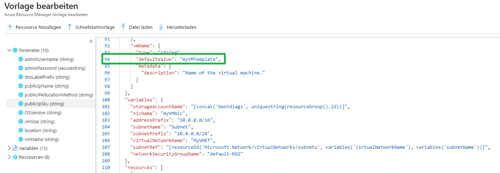
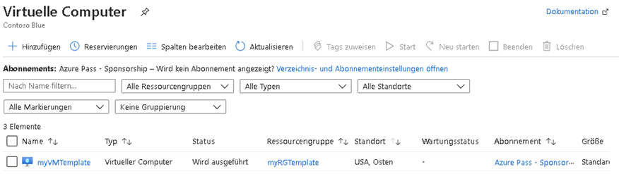
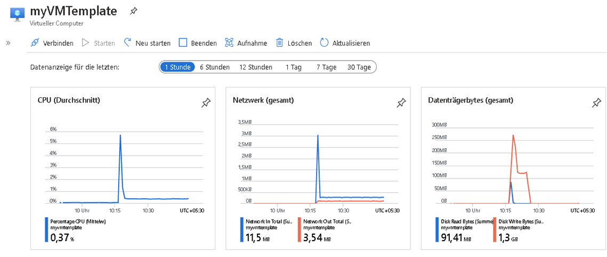
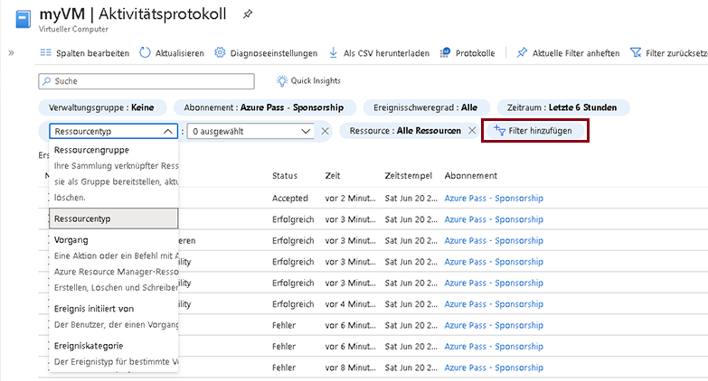

---
wts:
    title: '09 - Erstellen eines virtuellen Computers mit Hilfe einer Vorlage (10 Min.)'
    module: 'Modul 03: Kernlösungen und Verwaltungstools beschreiben'
---
# 09 – Erstellen eines virtuellen Computers mit Hilfe einer Vorlage (10 Min.)

In dieser exemplarischen Vorgehensweise stellen wir einen virtuellen Computer mit einer Schnellstartvorlage bereit und untersuchen Überwachungsfunktionen.

# Aufgabe 1: Schnellstartkatalog erkunden und eine Vorlage finden 

In dieser Aufgabe durchsuchen wir den Azure-Schnellstartkatalog und stellen eine Vorlage bereit, mit der ein virtueller Computer erstellt wird. 

1. Öffnen Sie in der Laborumgebung ein neues Browserfenster, und geben Sie „https://azure.microsoft.com/de-de/resources/templates/?azure-portal=true“ ein. Im Katalog finden Sie eine Reihe beliebter und kürzlich aktualisierter Vorlagen. Diese Vorlagen automatisieren die Bereitstellung von Azure-Ressourcen, einschließlich der Installation gängiger Softwarepakete. Durchsuchen Sie die vielen verschiedenen Arten von Vorlagen, die verfügbar sind.

2. Wählen Sie **Einfache Windows-VM bereitstellen** aus.

3. Klicken Sie auf die Schaltfläche **In Azure bereitstellen**. Ihre Browsersitzung wird automatisch zum [Azure-Portal](http://portal.azure.com/) umgeleitet.

    **HINWEIS**: Die Schaltfläche **Bereitstellung in Azure** ermöglicht es Ihnen, die Vorlage über das Azure-Portal bereitzustellen. Während einer solchen Bereitstellung werden Sie nur zur Eingabe eines kleinen Satzes von Konfigurationsparametern aufgefordert. 

4. Melden Sie sich mit den Anmeldeinformationen, die Sie zuvor in den Anweisungen erhalten haben, bei Ihrem Azure-Abonnement an, wenn Sie dazu aufgefordert werden.

5. Klicken Sie auf **Vorlage bearbeiten**. Die Resource Manager-Vorlage verwendet das JSON-Format. Überprüfen Sie die Parameter und Variablen.  Suchen Sie anschließend den Parameter für den Namen des virtuellen Computers. Ändern Sie den Namen zu **myVMTemplate**. **Speichern** Sie Ihre Änderungen. 

    

6. Konfigurieren Sie nun die für die Vorlage erforderlichen Parameter (ersetzen Sie ***xxxx*** im DNS-Bezeichnungspräfix durch Buchstaben und Ziffern, sodass die Bezeichnung global eindeutig ist). Behalten Sie ansonsten die Standardeinstellungen bei. 

    | Einstellung| Wert|
    |----|----|
    | Abonnement | **Standardeinstellungen beibehalten**|
    | Ressourcengruppe | **Erstellen einer neuen Ressourcengruppe** |
    | Region | Standard beibehalten |
    | Admin-Benutzername | **azureuser** |
    | Admin-Kennwort | **Pa$$w0rd1234** |
    | Präfix der DNS-Bezeichnung | **myvmtemplatexxxx** |
    | Betriebssystemversion | **2019-Datacenter** |

7. Klicken Sie auf **Überprüfen + Erstellen**.

8. Überwachen Sie Ihre Bereitstellung. 

# Aufgabe 2: Überprüfen und Überwachen der Bereitstellung Ihres virtuellen Computers

In dieser Aufgabe überprüfen wir, ob der virtuelle Computer ordnungsgemäß bereitgestellt wurde. 

1. Auf dem Blatt **Alle Dienste** suchen und wählen Sie **Virtuelle Computer** aus.

2. Stellen Sie sicher, dass Ihr neuer virtueller Computer erstellt wurde. 

    

3. Wählen Sie Ihren virtuellen Computer im Bereich **Übersicht** aus, wählen Sie die Registerkarte **Überwachung** aus, und scrollen Sie nach unten zu den Überwachungsdaten.

    **HINWEIS**: Der Überwachungszeitraum kann von einer Stunde bis zu 30 Tagen angepasst werden.

4. Überprüfen Sie verschiedene Diagramme, einschließlich **CPU (Durchschnitt)**, **Netzwerk (gesamt)**, und **Festplattenbytes (gesamt)**. 

    

5. Klicken Sie auf ein Diagramm. Beachten Sie, dass Sie eine **Metrik hinzufügen** und den Diagrammtyp ändern können.

6. Kehren Sie zum Blatt **Übersicht** zurück. (Umschalter nach links ziehen)
7. Klicken Sie auf **Aktivitätsprotokoll** (linker Bereich). In Aktivitätsprotokollen werden Ereignisse wie das Erstellen oder Ändern von Ressourcen aufgezeichnet. 

8. Klicken Sie auf **Filter hinzufügen**, und experimentieren Sie mit der Suche nach verschiedenen Ereignistypen und Operationen. 

    

Herzlichen Glückwunsch! Sie haben eine Ressource mit einer Vorlage erstellt und die Vorlage in Azure bereitgestellt.

**HINWEIS**: Um zusätzliche Kosten zu vermeiden, können Sie diese Ressourcengruppe bei Bedarf entfernen. Suchen Sie nach Ressourcengruppen, klicken Sie auf Ihre Ressourcengruppe und dann auf **Ressourcengruppe löschen**. Überprüfen Sie den Namen der Ressourcengruppe, und klicken Sie dann auf **Löschen**. Überwachen Sie die **Benachrichtigungen**, um zu sehen, wie der Löschvorgang abläuft.
