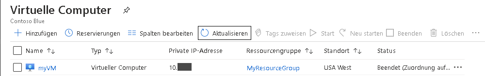
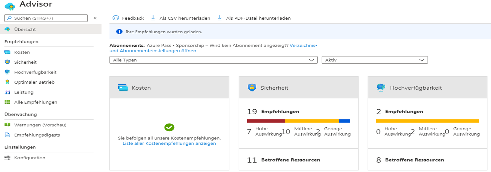
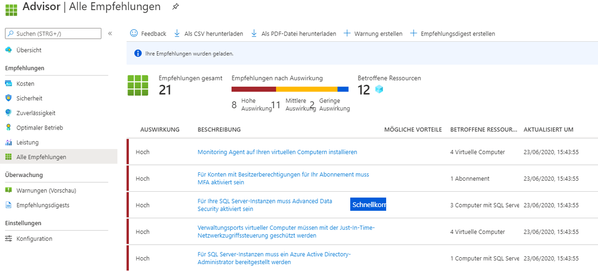

---
wts:
  title: 10 – Erstellen eines virtuellen Computers mithilfe von PowerShell (10 Min.)
  module: 'Module 03: Describe core solutions and management tools'
---
# <a name="10---create-a-vm-with-powershell-10-min"></a>10 – Erstellen eines virtuellen Computers mithilfe von PowerShell (10 Min.)

In dieser exemplarischen Vorgehensweise konfigurieren wir die Cloud Shell, erstellen mithilfe des Azure PowerShell-Moduls eine Ressourcengruppe und einen virtuellen Computer und überprüfen die Empfehlungen von Azure Advisor. 

# <a name="task-1-configure-the-cloud-shell"></a>Aufgabe 1: Konfigurieren der Cloud Shell 

In dieser Aufgabe konfigurieren wir Cloud Shell. 

1. Melden Sie sich beim [Azure-Portal](https://portal.azure.com) an. ** Sie finden Ihre Anmeldeinformationen in der Registerkarte „Ressourcen“ (direkt neben dieser Registerkarte „Anweisungen“). **
2. Öffnen Sie im Azure-Portal die Option **Azure Cloud Shell**, indem Sie auf das Symbol oben rechts im Azure-Portal klicken.

    

3. Wenn Sie aufgefordert werden, entweder **Bash** oder **PowerShell** auszuwählen, wählen Sie **PowerShell** aus.

4. Wählen Sie auf dem Bildschirm **Für Sie wurde kein Speicher bereitgestellt** die Option **Erweiterte Einstellungen anzeigen** aus, und geben Sie die folgenden Informationen ein.

    | Einstellungen | Werte |
    |  -- | -- |
    | Ressourcengruppe | **Neue Ressourcengruppe erstellen** |
    | Speicherkonto (Erstellen Sie ein neues Konto mit einem global eindeutigen Namen, z. B. cloudshellstoragemystorage) | **cloudshellxxxxxxx** |
    | Dateifreigabe (neu erstellen) | **shellstorage** |

5. Wählen Sie **Speicher erstellen** aus.

# <a name="task-2-create-a-resource-group-and-virtual-machine"></a>Aufgabe 2: Erstellen einer Ressourcengruppe und eines virtuellen Computers

In dieser Aufgabe erstellen Sie mithilfe von PowerShell eine Ressourcengruppe und einen virtuellen Computer.  

1. Stellen Sie sicher, dass im Dropdownmenü oben links im Cloud Shell-Bereich der Eintrag **PowerShell** ausgewählt ist.

2. Verify your new resource group by running the following command in the Powershell window. Press <bpt id="p1">**</bpt>Enter<ept id="p1">**</ept> to run the command.

    ```PowerShell
    Get-AzResourceGroup | Format-Table
    ```

3. Erstellen Sie einen virtuellen Computer, indem Sie den folgenden Befehl im Terminalfenster einfügen. 

    ```PowerShell
    New-AzVm `
    -ResourceGroupName "myRGPS" `
    -Name "myVMPS" `
    -Location "East US" `
    -VirtualNetworkName "myVnetPS" `
    -SubnetName "mySubnetPS" `
    -SecurityGroupName "myNSGPS" `
    -PublicIpAddressName "myPublicIpPS"
    ```
    
4. Wenn Sie dazu aufgefordert werden, geben Sie den Benutzernamen (**azureuser**) und das Kennwort (**Pa$$w0rd1234**) an, die als lokales Administratorkonto auf diesen virtuellen Computern konfiguriert werden.

5. Warten Sie, bis die VM erstellt wurde, und schließen Sie den Cloud Shell-Bereich der PowerShell-Sitzung.

6. In the Azure portal, search for <bpt id="p1">**</bpt>Virtual machines<ept id="p1">**</ept> and verify the <bpt id="p2">**</bpt>myVMPS<ept id="p2">**</ept> is running. This may take a few minutes.

    

7. Greifen Sie auf den neuen virtuellen Computer zu, und überprüfen Sie die Einstellungen für „Übersicht“ und „Netzwerk“, um sicherzustellen, dass Ihre Informationen korrekt bereitgestellt wurden. 

# <a name="task-3-execute-commands-in-the-cloud-shell"></a>Aufgabe 3: Ausführen von Befehlen in Cloud Shell

In dieser Aufgabe üben wir das Ausführen von PowerShell-Befehlen aus der Cloud Shell. 

1. Öffnen Sie im Azure-Portal die Option **Azure Cloud Shell**, indem Sie auf das Symbol oben rechts im Azure-Portal klicken.

2. Stellen Sie sicher, dass im Dropdownmenü oben links im Cloud Shell-Bereich der Eintrag **PowerShell** ausgewählt ist.

3. Retrieve information about your virtual machine including name, resource group, location, and status. Notice the PowerState is <bpt id="p1">**</bpt>running<ept id="p1">**</ept>.

    ```PowerShell
    Get-AzVM -name myVMPS -status | Format-Table -autosize
    ```

4. Beenden Sie den virtuellen Computer mit dem folgenden Befehl. 

    ```PowerShell
    Stop-AzVM -ResourceGroupName myRGPS -Name myVMPS
    ```
5. When prompted confirm (Yes) to the action. Wait for <bpt id="p1">**</bpt>Succeeded<ept id="p1">**</ept> status.

6. Verify your virtual machine state. The PowerState should now be <bpt id="p1">**</bpt>deallocated<ept id="p1">**</ept>. You can also verify the virtual machine status in the portal. Close Cloudshell.

    ```PowerShell
    Get-AzVM -name myVMPS -status | Format-Table -autosize
    ```

# <a name="task-4-review-azure-advisor-recommendations"></a>Aufgabe 4: Überprüfen von Azure Advisor-Empfehlungen

**Hinweis:** Diese Aufgabe finden Sie im Lab „Erstellen eines virtuellen Computers mit der Azure CLI“. 

In dieser Aufgabe überprüfen wir die Azure Advisor-Empfehlungen für unseren virtuellen Computer. 

1. Suchen Sie auf Blatt **Alle Dienste** nach **Advisor**, und wählen Sie diese Option aus. 

2. On the <bpt id="p1">**</bpt>Advisor<ept id="p1">**</ept> blade, select <bpt id="p2">**</bpt>Overview<ept id="p2">**</ept>. Notice recommendations are grouped by Reliability, Security, Performance, and Cost. 

    

3. Wählen Sie **Alle Empfehlungen** aus und Sie sich Zeit, um die einzelnen Empfehlungen und vorgeschlagenen Maßnahmen anzuzeigen. 

    **Hinweis:** Die Empfehlungen sind je nach Ihren Ressourcen unterschiedlich. 

    

4. Beachten Sie, dass Sie die Empfehlungen als CSV- oder PDF-Datei herunterladen können. 

5. Beachten Sie, dass Sie Warnungen erstellen können. 

6. Wenn Sie Zeit haben, experimentieren Sie weiter mit Azure PowerShell. 

Congratulations! You have configured Cloud Shell, created a virtual machine using PowerShell, practiced with PowerShell commands, and viewed Advisor recommendations.

<bpt id="p1">**</bpt>Note<ept id="p1">**</ept>: To avoid additional costs, you can optionally remove this resource group. Search for resource groups, click your resource group, and then click <bpt id="p1">**</bpt>Delete resource group<ept id="p1">**</ept>. Verify the name of the resource group and then click <bpt id="p1">**</bpt>Delete<ept id="p1">**</ept>. Monitor the <bpt id="p1">**</bpt>Notifications<ept id="p1">**</ept> to see how the delete is proceeding.
