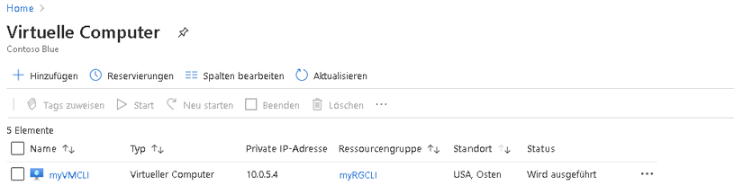
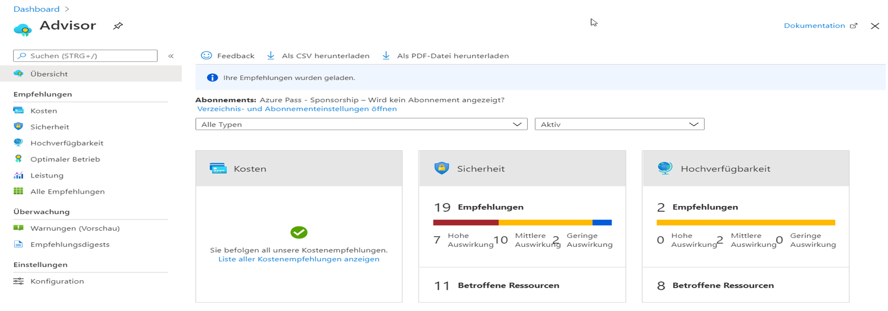
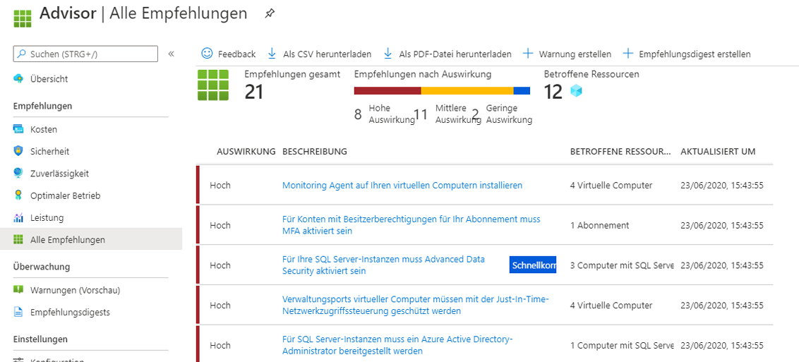

---
wts:
  title: 11 – Erstellen eines virtuellen Computers mithilfe der CLI (10 Min.)
  module: 'Module 03: Describe core solutions and management tools'
---
# <a name="11---create-a-vm-with-the-cli-10-min"></a>11 – Erstellen eines virtuellen Computers mithilfe der CLI (10 Min.)

In dieser exemplarischen Vorgehensweise konfigurieren wir die Cloud Shell, erstellen mithilfe von Azure CLI eine Ressourcengruppe und einen virtuellen Computer und überprüfen die Empfehlungen von Azure Advisor. 

# <a name="task-1-configure-the-cloud-shell"></a>Aufgabe 1: Konfigurieren der Cloud Shell 

In dieser Aufgabe konfigurieren wir Cloud Shell und verwenden Azure CLI, um eine Ressourcengruppe und einen virtuellen Computer zu erstellen.  

1. Melden Sie sich beim [Azure-Portal](https://portal.azure.com) an.

2. Öffnen Sie im Azure-Portal die Option **Azure Cloud Shell**, indem Sie auf das Symbol oben rechts im Azure-Portal klicken.

    
   
3. Wenn Sie im Willkommensdialog für Azure Cloud Shell dazu aufgefordert werden, entweder **Bash** oder **PowerShell** auszuwählen, wählen Sie **Bash** aus. 

4. A new window will open stating <bpt id="p1">**</bpt>You have no storage mounted<ept id="p1">**</ept>. Select <bpt id="p1">**</bpt>advanced settings<ept id="p1">**</ept>.

5. Füllen Sie in den erweiterten Einstellungen die folgenden Felder aus, und klicken Sie auf „Speicher erstellen“:
    - Ressourcengruppe: **Neue Ressourcengruppe erstellen**
    - Speicherkonto: Erstellen Sie ein neues Konto mit einem global eindeutigen Namen, z. B. cloudshellxyzstorage.
    - Dateifreigabe: Erstellen Sie eine neue Kampagne mit dem Namen cloudshellfileshare.


# <a name="task-2-use-cli-to-create-a-virtual-machine"></a>Aufgabe 2: Erstellen eines virtuellen Computers per CLI

In dieser Aufgabe verwenden wir Azure CLI, um eine Ressourcengruppe und einen virtuellen Computer zu erstellen.

1. Stellen Sie sicher, dass **Bash** im Dropdownmenü oben links im Cloud Shell-Bereich ausgewählt ist (wählen Sie andernfalls diese Option aus).

    


2. Überprüfen Sie mit dem folgenden Befehl, in welcher Ressourcengruppe Sie sich befinden.

    ```cli
    az group list --output table
    ```

4. In Cloud Shell enter the command below and make sure that each line, except for the last one, is followed by the backslash (<ph id="ph1">`\`</ph>) character. If you type the whole command on the same line, do not use any backslash characters. 

    ```cli
    az vm create \
    --name myVMCLI \
    --resource-group myRGCLI \
    --image UbuntuLTS \
    --location EastUS2 \
    --admin-username azureuser \
    --admin-password Pa$$w0rd1234
    ```

    >**Hinweis:** Wenn Sie die Befehlszeile auf einem Windows-Computer verwenden, ersetzen Sie den umgekehrten Schrägstrich (`\`) durch das Caretzeichen (`^`).

    <bpt id="p1">**</bpt>Note<ept id="p1">**</ept>: The command will take 2 to 3 minutes to complete. The command will create a virtual machine and various resources associated with it such as storage, networking and security resources. Do not continue to the next step until the virtual machine deployment is complete. 

5. Wenn der Befehl ausgeführt wurde, schließen Sie im Browserfenster den Cloud Shell-Bereich.

6. Suchen Sie im Azure-Portal nach **Virtuelle Computer**, und überprüfen Sie, ob **myVMCLI** ausgeführt wird.

    


# <a name="task-3-execute-commands-in-the-cloud-shell"></a>Aufgabe 3: Ausführen von Befehlen in Cloud Shell

In dieser Aufgabe üben wir das Ausführen von CLI-Befehlen über Cloud Shell. 

1. Öffnen Sie im Azure-Portal die Option **Azure Cloud Shell**, indem Sie auf das Symbol oben rechts im Azure-Portal klicken.

2. Stellen Sie sicher, dass **Bash** im Dropdownmenü oben links im Cloud Shell-Bereich ausgewählt ist.

3. Retrieve information about the virtual machine you provisioned, including name, resource group, location, and status. Notice the PowerState is <bpt id="p1">**</bpt>running<ept id="p1">**</ept>.

    ```cli
    az vm show --resource-group myRGCLI --name myVMCLI --show-details --output table 
    ```

4. Stop the virtual machine. Notice the message that billing continues until the virtual machine is deallocated. 

    ```cli
    az vm stop --resource-group myRGCLI --name myVMCLI
    ```

5. Verify your virtual machine status. The PowerState should now be <bpt id="p1">**</bpt>stopped<ept id="p1">**</ept>.

    ```cli
    az vm show --resource-group myRGCLI --name myVMCLI --show-details --output table 
    ```

# <a name="task-4-review-azure-advisor-recommendations"></a>Aufgabe 4: Überprüfen von Azure Advisor-Empfehlungen

In dieser Aufgabe überprüfen wir die Empfehlungen von Azure Advisor.

   **Hinweis:** Wenn Sie das vorherige Lab (Erstellen eines virtuellen Computers mithilfe von PowerShell) abgeschlossen haben, haben Sie diese Aufgabe bereits ausgeführt. 

1. Suchen Sie auf Blatt **Alle Dienste** nach **Advisor**, und wählen Sie diese Option aus. 

2. On the <bpt id="p1">**</bpt>Advisor<ept id="p1">**</ept> blade, select <bpt id="p2">**</bpt>Overview<ept id="p2">**</ept>. Notice recommendations are grouped by Reliability, Security, Performance, and Cost. 

    

3. Wählen Sie **Alle Empfehlungen** aus und Sie sich Zeit, um die einzelnen Empfehlungen und vorgeschlagenen Maßnahmen anzuzeigen. 

    **Hinweis:** Die Empfehlungen sind je nach Ihren Ressourcen unterschiedlich. 

    

4. Beachten Sie, dass Sie die Empfehlungen als CSV- oder PDF-Datei herunterladen können. 

5. Beachten Sie, dass Sie Warnungen erstellen können. 

6. Wenn Sie Zeit haben, experimentieren Sie weiter mit Azure CLI. 

Congratulations! You have configured Cloud Shell, created a virtual machine using Azure CLI, practiced with Azure CLI commands, and viewed Advisor recommendations.

<bpt id="p1">**</bpt>Note<ept id="p1">**</ept>: To avoid additional costs, you can optionally remove this resource group. Search for resource groups, click your resource group, and then click <bpt id="p1">**</bpt>Delete resource group<ept id="p1">**</ept>. Verify the name of the resource group and then click <bpt id="p1">**</bpt>Delete<ept id="p1">**</ept>. Monitor the <bpt id="p1">**</bpt>Notifications<ept id="p1">**</ept> to see how the delete is proceeding.
