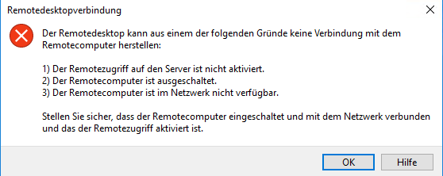

---
wts:
  title: 13 – Sicherer Netzwerkdatenverkehr (10 Min.)
  module: 'Module 04: Describe general security and network security features'
ms.openlocfilehash: 27216b913111de76e00546319b56f69034819918
ms.sourcegitcommit: 26c283fffdd08057fdce65fa29de218fff21c7d0
ms.translationtype: HT
ms.contentlocale: de-DE
ms.lasthandoff: 01/27/2022
ms.locfileid: "137907975"
---
# 13 – Sicherer Netzwerkdatenverkehr (10 Min.)

In dieser Anleitung konfigurieren wir eine Netzwerksicherheitsgruppe.

# Aufgabe 1: Erstellen einer VM

In dieser Aufgabe erstellen wir einen virtuellen Windows Server 2019 Datacenter-Computer. 

1. Melden Sie sich beim [Azure-Portal](https://portal.azure.com) an.

2. Suchen Sie auf dem Blatt **Alle Dienste** den Eintrag **Computer**, wählen Sie ihn aus, und klicken Sie auf **+ Hinzufügen, + Erstellen, + Neu**.

3. Geben Sie auf der Registerkarte **Grundlagen** die folgenden Informationen ein (belassen Sie ansonsten die Standardeinstellungen):

    | Einstellungen | Werte |
    |  -- | -- |
    | Subscription | **Standardeinstellung verwenden** |
    | Resource group | **Neue Ressourcengruppe erstellen** |
    | Name des virtuellen Computers | **SimpleWinVM** |
    | Region | **(USA) USA, Osten**|
    | Image | **Windows Server 2019 Datacenter, Gen2**|
    | Size | **Standard D2s v3**|
    | Benutzername des Administratorkontos | **azureuser** |
    | Kennwort für das Administratorkonto | **Pa$$w0rd1234**|
    | Regeln für eingehende Ports | **None**|

4. Wechseln Sie zur Registerkarte **Netzwerk**, und konfigurieren Sie die folgende Einstellung:

    | Einstellungen | Werte |
    | -- | -- |
    | NIC-Netzwerksicherheitsgruppe | **None**|

5. Wechseln Sie zur Registerkarte **Verwaltung**, und wählen Sie im Abschnitt **Überwachung** die folgende Einstellung aus:

    | Einstellungen | Werte |
    | -- | -- |
    | Startdiagnose | **Deaktivieren**|

6. Übernehmen Sie die verbleibenden Standardeinstellungen, und klicken Sie dann auf die Schaltfläche **Überprüfen + erstellen** am unteren Rand der Seite.

7. Sobald die Validierung bestanden ist, klicken Sie auf die Schaltfläche **Erstellen**. Es kann etwa fünf Minuten dauern, den virtuellen Computer bereitzustellen.

8. Überwachen Sie die Bereitstellung. Das Erstellen der Ressourcengruppe und des virtuellen Computers kann einige Minuten dauern. 

9. Klicken Sie im Bereitstellungsblatt oder im Infobereich auf **Zu Ressource wechseln**. 

10. Klicken Sie auf dem Blatt **SimpleWinVM** des virtuellen Computers auf **Netzwerk**, und überprüfen Sie die Registerkarte **Regeln für eingehende Ports**. Beachten Sie, dass der Netzwerkschnittstelle des virtuellen Computers oder dem Subnetz, an das die Netzwerkschnittstelle angeschlossen ist, keine Netzwerksicherheitsgruppe zugeordnet ist.

    **Hinweis:** Identifizieren Sie den Namen der Netzwerkschnittstelle. Sie werden dies in der nächsten Aufgabe benötigen.

# Aufgabe 2: Erstellen einer Netzwerksicherheitsgruppe

In dieser Aufgabe erstellen wir eine Netzwerksicherheitsgruppe und ordnen sie der Netzwerkschnittstelle zu. 

1. Suchen Sie auf dem Blatt **Alle Dienste** den Eintrag **Netzwerksicherheitsgruppen**, wählen Sie ihn aus, und klicken Sie auf **+ Hinzufügen, + Erstellen, + Neu**.

2. Geben Sie die folgenden Einstellungen auf der Registerkarte **Grundlagen** des Blatts **Netzwerksicherheitsgruppe erstellen** an.

    | Einstellung | Wert |
    | -- | -- |
    | Subscription | **Standardabonnement verwenden** |
    | Resource group | **Standard im Dropdownfeld auswählen** |
    | Name | **myNSGSecure** |
    | Region | **(USA) USA, Osten**  |

3. Klicken Sie auf **Überprüfen + erstellen** und nach der Validierung auf **Erstellen**.

4. Klicken Sie nach dem Erstellen des NSG auf **Zu Ressource wechseln**.

5. Klicken Sie unter **Einstellungen** auf **Netzwerkschnittstellen** und dann auf **Zuordnen**.

6. Wählen Sie die in der vorherigen Aufgabe identifizierte Netzwerkschnittstelle aus. 

# Aufgabe 3: Konfigurieren einer Sicherheitsregel für eingehende Ports zum Zulassen von RDP

In dieser Aufgabe lassen Sie RDP-Datenverkehr für den virtuellen Computer zu, indem Sie eine eingehende Sicherheitsportregel konfigurieren. 

1. Navigieren Sie im Azure-Portal zum Blatt des virtuellen Computers **SimpleWinVM**. 

2. Klicken Sie im Bereich **Übersicht** auf **Verbinden**.

3. Versuchen Sie, sich mit dem virtuellen Computer zu verbinden, indem Sie RDP auswählen und die RDP-Datei herunterladen und ausführen. Standardmäßig erlaubt die Netzwerksicherheitsgruppe kein RDP. Schließen Sie das Fehlerfenster. 

    

4. Scrollen Sie auf dem Blatt des virtuellen Computers nach unten zum Abschnitt **Einstellungen**, und klicken Sie auf **Netzwerk**. Beachten Sie, dass die Eingangsregeln für die Netzwerksicherheitsgruppe **myNSGSecure (angeschlossen an Netzwerkschnittstelle: myVMNic)** den gesamten eingehenden Datenverkehr mit Ausnahme des Datenverkehrs innerhalb des virtuellen Netzwerks und der Lastenausgleichstests verweigern.

5. Klicken Sie auf der Registerkarte **Regeln für eingehende Ports** auf **Regel für eingehende Ports hinzufügen**. Klicken Sie auf **Hinzufügen**, wenn Sie fertig sind. 

    | Einstellung | Wert |
    | -- | -- |
    | `Source` | **Alle**|
    | Source port ranges | **\*** |
    | Destination | **Alle** |
    | Zielportbereiche | **3389** |
    | Protokoll | **TCP** |
    | Aktion | **Zulassen** |
    | Priorität | **300** |
    | Name | **AllowRDP** |

6. Wählen Sie **Hinzufügen** aus, warten Sie, bis die Regel bereitgestellt wurde, und versuchen Sie dann erneut, sich per RDP mit dem virtuellen Computer zu verbinden, indem Sie zu **Verbinden** zurückkehren. Dieses Mal sollte die Verbindung erfolgreich hergestellt werden. Denken Sie daran, der Benutzername ist **azureuser**, und das Kennwort lautet **Pa$$w0rd1234**.

# Aufgabe 4: Konfigurieren einer Sicherheitsregel für ausgehende Ports zum Verweigern des Internetzugriffs

In dieser Aufgabe erstellen wir eine NSG-Regel für ausgehende Ports, die den Internetzugriff verweigert, und testen dann, ob die Regel funktioniert.

1. Fahren Sie in der RDP-Sitzung Ihres virtuellen Computers fort. 

2. Öffnen Sie nach dem Start des Computers den **Internet Explorer**-Browser. 

3. Stellen Sie sicher, dass Sie auf **https://www.bing.com** zugreifen können, und schließen Sie dann Internet Explorer. Sie müssen sich durch die erweiterten Sicherheits-Popups im IE durcharbeiten. 

    **Hinweis:** Wir konfigurieren nun eine Regel, um den ausgehenden Internetzugang zu verweigern. 

4. Kehren Sie zum Azure-Portal zurück, und navigieren Sie zum Blatt des virtuellen Computers **SimpleWinVM**. 

5. Klicken Sie unter **Einstellungen** auf **Netzwerk** und dann auf **Regeln für ausgehende Ports**.

6. Beachten Sie, dass es die Regel **AllowInternetOutbound** gibt. Dies ist eine Standardregel und kann nicht entfernt werden. 

7. Klicken Sie auf **Regel für ausgehende Ports hinzufügen** rechts von der Netzwerksicherheitsgruppe **myNSGSecure (angeschlossen an Netzwerkschnittstelle: myVMNic)** , und konfigurieren Sie eine neue ausgehende Sicherheitsregel mit einer höheren Priorität, die Internetdatenverkehr verweigert. Klicken Sie auf **Hinzufügen**, wenn Sie fertig sind. 

    | Einstellung | Wert |
    | -- | -- |
    | `Source` | **Alle**|
    | Source port ranges | **\*** |
    | Destination | **Diensttag** |
    | Zieldiensttag | **Internet** |
    | Zielportbereiche | **\*** |
    | Protocol | **TCP** |
    | Aktion | **Deny** (Verweigern) |
    | Priority | **4000** |
    | Name | **DenyInternet** |

8. Klicken Sie auf **Hinzufügen**. Kehren Sie zur VM zurück, mit der Sie per RDP verbunden sind. 

9. Navigieren Sie zu **https://www.microsoft.com**. Die Seite sollte nicht angezeigt werden. Möglicherweise müssen Sie sich durch zusätzliche erweiterte Sicherheits-Popups im IE durcharbeiten.  

**Hinweis:** Um zusätzliche Kosten zu vermeiden, können Sie diese Ressourcengruppe bei Bedarf entfernen. Suchen Sie nach Ressourcengruppen, klicken Sie auf Ihre Ressourcengruppe und dann auf **Ressourcengruppe löschen**. Überprüfen Sie den Namen der Ressourcengruppe und klicken Sie dann auf **Löschen**. Überwachen Sie die **Benachrichtigungen**, um zu sehen, wie der Löschvorgang abläuft.
