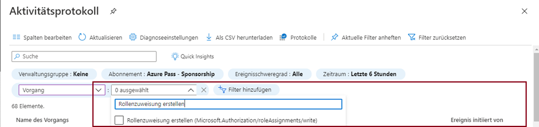

---
wts:
  title: 14 – Zugriff mit RBAC verwalten (5 Min.)
  module: 'Module 05: Describe identity, governance, privacy, and compliance features'
---
# 14 – Zugriff mit RBAC verwalten (5 Min.)

In dieser exemplarischen Vorgehensweise werden wir Berechtigungsrollen zu Ressourcen zuweisen und Protokolle anzeigen.

# Aufgabe 1: Anzeigen und Zuweisen von Rollen

In dieser Aufgabe weisen wir die Rolle „Mitwirkender für virtuelle Computer“ zu. 

1. Melden Sie sich beim [Azure-Portal](https://portal.azure.com) an.

2. Suchen Sie auf dem Blatt **Alle Dienste** nach **Ressourcengruppen**, und wählen Sie diese Option aus. Klicken Sie anschließend auf **+ Hinzufügen +Neu +Erstellen**.

3. Erstellen Sie eine neue Ressourcengruppe. Klicken Sie auf **Erstellen**, wenn Sie fertig sind. 

    | Einstellung | Wert |
    | -- | -- |
    | Subscription | **Standardeinstellung verwenden** |
    | Resource group | **myRGRBAC** |
    | Region | **(USA) USA, Osten** |
   

4. Erstellen Sie **Überprüfen + erstellen**, und klicken Sie dann auf **Erstellen**.

5. **Aktualisieren** Sie die Seite „Ressourcengruppe“, und klicken Sie auf den Eintrag, der die neu erstellte Ressourcengruppe darstellt.

6. Klicken Sie auf das Blatt **Zugriffssteuerung (IAM)** , und wechseln Sie dann auf die Registerkarte **Rollen**. Blättern Sie durch die große Anzahl an Rollendefinitionen, die verfügbar sind. Verwenden Sie die Informationssymbole, um eine Vorstellung von den Berechtigungen der einzelnen Rollen zu erhalten. Beachten Sie, dass es auch Informationen zur Anzahl der Benutzer und Gruppen gibt, die jeder Rolle zugewiesen sind.
7. 

7. Wechseln Sie zur Registerkarte **Rollenzuweisungen** des Blatts **myRGRBAC - Zugriffssteuerung (IAM)** , klicken Sie auf **Hinzufügen** und dann auf **Rollenzuweisung hinzufügen**. Suchen Sie nach der Rolle „Mitwirkender für virtuelle Computer“, und wählen Sie die Rolle aus. Wechseln Sie zur Registerkarte „Mitglieder“, und legen Sie den Zugriff fest auf: Benutzer, Gruppe oder Dienstprinzipal. Klicken Sie dann auf „+ Mitglieder auswählen“, geben Sie Ihren Namen in die Popupsuchfunktion ein, und klicken Sie auf „Auswählen“. Klicken Sie dann auf „Überprüfen und zuweisen“.

    
    

 

    **Hinweis:** Mit der Rolle „Mitwirkender für virtuelle Computer“ können Sie virtuelle Computer verwalten, jedoch nicht auf deren Betriebssystem zugreifen oder das virtuelle Netzwerk und das Speicherkonto verwalten, mit denen sie verbunden sind.

  

8. **Aktualisieren** Sie die Seite „Rollenzuweisungen“ und stellen Sie sicher, dass Sie jetzt als Mitwirkender eines virtuellen Computers aufgeführt sind. 

    **Hinweis:** Diese Zuweisung gewährt Ihnen keine zusätzlichen Berechtigungen, da Ihr Konto bereits über die Besitzerrolle verfügt, die alle mit der Rolle „Mitwirkender“ verbundenen Berechtigungen enthält.

# Aufgabe 2: Überwachen von Rollenzuweisungen und Entfernen einer Rolle

In dieser Aufgabe werden wir anhand des Aktivitätsprotokolls die Rollenzuweisung überprüfen und anschließend die Rolle entfernen. 

1. Klicken Sie auf dem Blatt „myRGRBAC Ressourcengruppen“ auf **Aktivitätsprotokoll**.

2. Klicken Sie auf **Filter hinzufügen**, wählen Sie **Vorgang** und dann **Rollenzuweisung erstellen** aus.

    

3. Überprüfen Sie, ob Ihre Rollenzuweisung im Aktivitätsprotokoll angezeigt wird. 

    **Hinweis:** Wissen Sie, wie Sie Ihre Rollenzuweisung entfernen können?

Glückwunsch! Sie haben eine Ressourcengruppe erstellt, ihr ein Zugriffsrolle zugewiesen und die Aktivitätsprotokolle geöffnet. 

**Hinweis:** Um zusätzliche Kosten zu vermeiden, können Sie diese Ressourcengruppe bei Bedarf entfernen. Suchen Sie nach Ressourcengruppen, klicken Sie auf Ihre Ressourcengruppe und dann auf **Ressourcengruppe löschen**. Überprüfen Sie den Namen der Ressourcengruppe und klicken Sie dann auf **Löschen**. Überwachen Sie die **Benachrichtigungen**, um zu sehen, wie der Löschvorgang abläuft.

