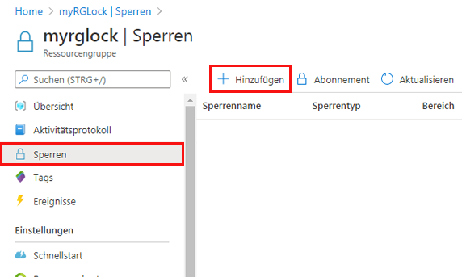
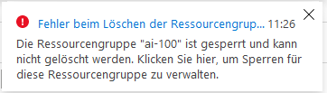
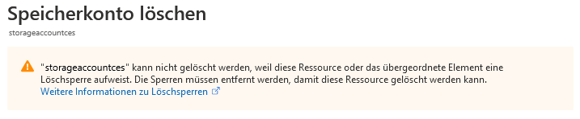
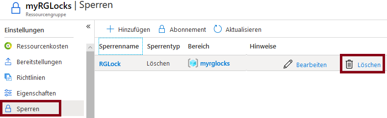

---
wts:
  title: 15 – Verwalten von Ressourcensperren (5 Min.)
  module: 'Module 05: Describe identity, governance, privacy, and compliance features'
---
# 15 – Verwalten von Ressourcensperren (5 Min.)

In dieser exemplarischen Vorgehensweise fügen wir der Ressourcengruppe eine Sperre hinzu und testen das Löschen der Ressourcengruppe. Sperren können in einem Abonnement auf Ressourcengruppen oder einzelne Ressourcen angewendet werden, um ein versehentliches Löschen oder Ändern kritischer Ressourcen zu verhindern.  

# Aufgabe 1:  Hinzufügen einer Sperre zur Ressourcengruppe und Testen des Löschvorgangs

In dieser Aufgabe fügen wir der Ressourcengruppe eine Ressourcensperre hinzu und testen das Löschen der Ressourcengruppe. 

1. Melden Sie sich beim [Azure-Portal](https://portal.azure.com) an.

2. Navigieren Sie im Azure-Portal zur Ressourcengruppe **myRGLocks**.

3. Sie können eine Sperre auf ein Abonnement, eine Ressourcengruppe oder eine einzelne Ressource anwenden, um ein versehentliches Löschen oder Ändern kritischer Ressourcen zu verhindern. 

4. Klicken Sie im Abschnitt **Einstellungen** auf **Sperren** und dann auf **+ Hinzufügen**. 

    

5. Konfigurieren Sie die neue Sperre. Klicken Sie anschließend auf **OK**. 

    | Einstellung | Wert |
    | -- | -- |
    | Sperrenname | RGLock |
    | Sperrentyp | **Löschen** |
    | | |

6. Klicken Sie auf **Übersicht** und dann auf **Ressourcengruppe löschen**. Geben Sie den Namen der Ressourcengruppe ein, und klicken Sie dann auf **OK**. Sie erhalten eine Fehlermeldung, dass die Ressourcengruppe gesperrt ist und nicht gelöscht werden kann.

    

# Aufgabe 2: Testen des Löschens eines Mitglieds der Ressourcengruppe

In dieser Aufgabe testen wir, ob die Ressourcensperre ein Speicherkonto in der Ressourcengruppe schützt. 

1. Suchen Sie auf dem Blatt **Alle Dienste** den Eintrag **Speicherkonten**, wählen Sie ihn aus, und klicken Sie auf **+ Hinzufügen, + Erstellen oder auf + Neu**. 

2. Geben Sie auf dem Blatt **Speicherkonten** auf der Registerkarte **[+Hinzufügen +Neu +Erstellen]** die folgenden Informationen ein (ersetzen Sie **xxxx** im Speicherkontonamen durch einen global eindeutigen Namen, der aus Buchstaben und Ziffern besteht). Belassen Sie ansonsten die Standardeinstellungen.

    | Einstellung | Wert | 
    | --- | --- |
    | Abonnement | **Wählen Sie Ihr Abonnement aus** |
    | Resource group | **myRGLocks** |
    | Speicherkontoname | **storageaccountxxxx** |
    | Standort | **(USA) USA, Osten**  |
    | Leistung | **Standard** |
    | Kontoart | **StorageV2 (allgemein, Version 2)** |
    | Replikation | **Lokal redundanter Speicher (LRS)** |
    | Zugriffsebene (Standard) | **Heiße Ebene** |
   

3. Klicken Sie auf **Überprüfen + erstellen**, um die Einstellungen Ihres Speicherkontos zu überprüfen und Azure die Validierung der Konfiguration zu ermöglichen. 

4. Klicken Sie nach der Validierung auf **Erstellen**. Warten Sie auf die Benachrichtigung, dass das Konto erfolgreich erstellt wurde. 

5.  Warten Sie auf die Benachrichtigung, dass das Speicherkonto erfolgreich erstellt wurde. 

6. Greifen Sie auf Ihr neues Speicherkonto zu, und klicken Sie im Bereich **Übersicht** auf **Löschen**. Sie erhalten eine Fehlermeldung mit dem Hinweis, dass die Ressource oder ihr übergeordnetes Element eine Löschsperre aufweist. 

    

    **Hinweis:** Obwohl wir keine Sperre speziell für das Speicherkonto erstellt haben, haben wir eine Sperre auf der Ressourcengruppenebene erstellt, die das Speicherkonto enthält. Als solches verhindert die *übergeordnete* Ebenensperre, dass wir die Ressource löschen, und das Speicherkonto übernimmt die Sperre vom übergeordneten Element.

# Aufgabe 3: Entfernen der Ressourcensperre

In dieser Aufgabe entfernen wir die Ressourcensperre und testen. 

1. Wechseln Sie wieder zum Ressourcengruppen-Blatt **myRGLocks-XXXXXXXX**, und klicken Sie im Abschnitt **Einstellungen** auf **Sperren**.
    
2. Klicken Sie auf den Link **Löschen** ganz rechts neben dem Eintrag **myRGLocks-XXXXXXXX**, rechts von **Bearbeiten**.

    

3. Kehren Sie in das Blatt „Speicherkonto“ zurück und bestätigen Sie, dass Sie die Ressource jetzt löschen können.

Glückwunsch! Sie haben eine Ressourcengruppe erstellt, der Ressourcengruppe eine Sperre hinzugefügt und das Löschen getestet, das Löschen einer Ressource in der Ressourcengruppe getestet und die Ressourcensperre entfernt. 

**Hinweis:** Um zusätzliche Kosten zu vermeiden, können Sie diese Ressourcengruppe bei Bedarf entfernen. Suchen Sie nach Ressourcengruppen, klicken Sie auf Ihre Ressourcengruppe und dann auf **Ressourcengruppe löschen**. Überprüfen Sie den Namen der Ressourcengruppe und klicken Sie dann auf **Löschen**. Überwachen Sie die **Benachrichtigungen**, um zu sehen, wie der Löschvorgang abläuft.
