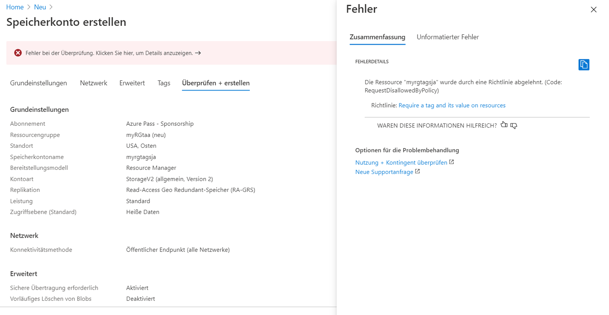
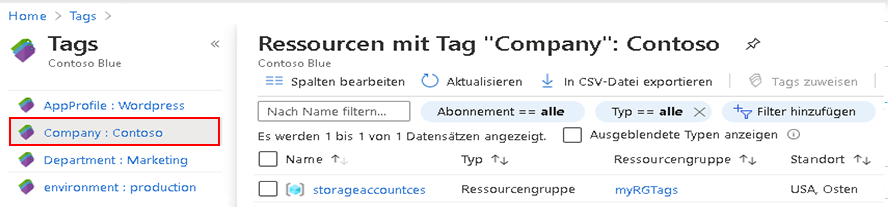
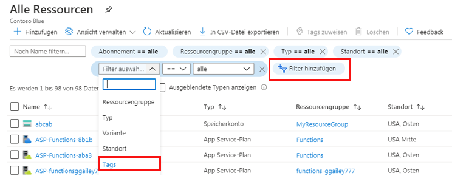

---
wts:
  title: 16 – Implementieren von Ressourcen-Tagging (5 Min.)
  module: 'Module 05: Describe identity, governance, privacy, and compliance features'
ms.openlocfilehash: cc7a298eb03be3dfcbcc1c69cfa7409bc94c0640
ms.sourcegitcommit: dfe52fea15c568547ba630e9b337ec8df957ad80
ms.translationtype: HT
ms.contentlocale: de-DE
ms.lasthandoff: 02/25/2022
ms.locfileid: "139213864"
---
# 16 – Implementieren von Ressourcen-Tagging (5 Min.)

In dieser exemplarischen Vorgehensweise erstellen wir eine Richtlinienzuweisung, für die Tagging erforderlich ist, erstellen ein Speicherkonto und testen das Tagging, zeigen Ressourcen mit einem angegebenen Tag an und entfernen die Tagging-Richtlinie.

# Aufgabe 1: Erstellen einer Richtlinienzuweisung 

In dieser Aufgabe konfigurieren wir die Richtlinie **Einen Tag für Ressourcen anfordern** und weisen sie unserem Abonnement zu. 

1. Melden Sie sich beim [Azure-Portal](https://portal.azure.com) an.

2. Suchen Sie auf dem Blatt **Alle Dienste** nach **Richtlinie**, und wählen Sie diese Option aus.

3. Scrollen Sie nach unten zum Abschnitt **Dokumenterstellung**, klicken Sie auf **Aufgaben**, und klicken Sie dann oben auf der Seite auf **Richtlinie zuweisen**.

4. Beachten Sie, dass der **Bereich** für unsere Richtlinie abonnementweit sein wird. 

5. Wählen Sie unter **Grundlagen** die Schaltfläche **Richtliniendefinition** mit den Auslassungspunkten (rechts neben dem Textfeld) aus. Geben Sie im **Suchfeld** den Wert **tag** ein. Eine Liste der verwandten Richtlinien mit dem Wort **tag** wird angezeigt. Blättern Sie nach unten zur Definition **Tag und zugehöriger Wert für Ressourcen erforderlich**, klicken Sie darauf, und klicken Sie dann auf **Auswählen**.

   
   
6.  Geben Sie auf der Registerkarte **Parameter** den Wert **Company : Contoso ** für den Tagnamen des Schüssel-Wert-Paars ein. Klicken Sie auf **Überprüfen + erstellen** und dann auf **Erstellen**.

  

7. Die Richtlinienzuweisung **Tag und zugehöriger Wert für Ressourcen erforderlich** ist jetzt vorhanden. Wenn eine Ressource erstellt wird, muss sie ein Tag mit dem Schlüssel „Company : Contoso“ enthalten.
   **Hinweis: Es kann bis zu 30 Minuten dauern, bis die Richtlinie übernommen wurde.** 

  

# Aufgabe 2: Erstellen eines Speicherkontos zum Testen des erforderlichen Taggings

In dieser Aufgabe erstellen wir Speicherkonten, um das erforderliche Tagging zu testen. 

1. Suchen Sie im Azure-Portal auf dem Blatt **Alle Dienste** nach **Speicherkonten**, und wählen Sie diese Option aus. Klicken Sie anschließend auf **+ Hinzufügen +Neu +Erstellen**.

2. Geben Sie auf dem Blatt **Speicherkonto erstellen** auf der Registerkarte **Grundlagen** die folgenden Informationen ein (ersetzen Sie **xxxx** im Speicherkontonamen durch Buchstaben und Ziffern, sodass der Name global eindeutig ist). Belassen Sie ansonsten die Standardeinstellungen.

    | Einstellung | Wert | 
    | --- | --- |
    | Subscription | **Standardeinstellung verwenden** |
    | Resource group | **Neue Ressourcengruppe erstellen** |
    | Speicherkontoname | **storageaccountxxxx** |
    | Standort | **(USA) USA, Osten** |

3. Klicken Sie auf **Überprüfen + erstellen**. 

    **Hinweis:** Wir testen, was passiert, wenn das Tag nicht angegeben wird. Es kann bis zu 30 Minuten dauern, bis die Richtlinie übernommen wurde.

4. Sie erhalten eine Meldung, dass die Validierung fehlgeschlagen ist. Klicken Sie auf die Nachricht **Hier klicken, um Details anzuzeigen**. Auf dem Blatt **Fehler** wird auf der Registerkarte **Zusammenfassung** eine Fehlermeldung angezeigt, die besagt, dass die Ressource von der Richtlinie nicht zugelassen wurde.

    **Hinweis:** Wenn Sie die Registerkarte „Unformatierter Fehler“ anzeigen, wird der erforderliche spezifische Tagname angezeigt. 

    

5. Schließen Sie den Bereich **Fehler**, und klicken Sie auf **Zurück** (unterer Bildschirmrand). Geben Sie die Tagging-Informationen an. 

    | Einstellung | Wert | 
    | --- | --- |
    | Tagname | **Company:Contoso** (möglicherweise nicht in der Dropdownliste vorhanden) |

6. Klicken Sie auf **Überprüfen + erstellen**, und vergewissern Sie sich, dass die Validierung erfolgreich war. Klicken Sie auf **Erstellen**, um das Speicherkonto bereitzustellen. 

# Aufgabe 3: Anzeigen aller Ressourcen mit einem bestimmten Tag

1. Suchen Sie im Azure-Portal auf dem Blatt **Alle Dienste** nach **Tags**, und wählen Sie diese Option aus.

2. Notieren Sie alle Tags und ihre Werte. Klicken Sie auf das Schlüssel-Wert-Paar **Company : Contoso**. Daraufhin wird ein Blatt mit dem neu erstellten Speicherkonto angezeigt, sofern Sie das Tag während der Bereitstellung einbezogen haben. 

   

3. Zeigen Sie im Portal das Blatt **Alle Ressourcen** an.

4. Klicken Sie auf **Filter hinzufügen**, und fügen Sie den Tag-Schlüssel **Unternehmen** als Filterkategorie hinzu. Wenn der Filter angewendet wird, wird nur Ihr Speicherkonto aufgelistet.

    

# Aufgabe 4: Löschen der Richtlinienzuweisung

In dieser Aufgabe werden wir die Richtlinie **Tag für Ressourcen erforderlich** entfernen, sodass sie unsere zukünftige Arbeit nicht beeinflusst. 

1. Suchen Sie im Portal auf dem Blatt **Alle Dienste** nach dem Punkt **Richtlinie**, und wählen Sie ihn aus.

2. Klicken Sie auf den Richtlinieneintrag **Tag für Ressourcen erforderlich**.

3. Klicken Sie im obersten Menü auf **Zuweisung löschen**.

4. Bestätigen Sie, dass Sie die Richtlinienzuweisung löschen möchten, indem Sie im Dialogfeld **Zuweisung löschen** auf **Ja** klicken.

5. Wenn Sie Zeit haben, erstellen Sie eine weitere Ressource ohne Tag, um sicherzustellen, dass die Richtlinie nicht mehr gültig ist.

Herzlichen Glückwunsch! In dieser exemplarischen Vorgehensweise haben wir eine Richtlinienzuweisung erstellt, für die Tagging erforderlich ist, eine Ressource (Speicherkonto) erstellt, die Tagging-Richtlinie getestet, Ressourcen mit einem angegebenen Tag angezeigt und die Tagging-Richtlinie entfernt.

**Hinweis:** Um zusätzliche Kosten zu vermeiden, können Sie diese Ressourcengruppe bei Bedarf entfernen. Suchen Sie nach Ressourcengruppen, klicken Sie auf Ihre Ressourcengruppe und dann auf **Ressourcengruppe löschen**. Überprüfen Sie den Namen der Ressourcengruppe und klicken Sie dann auf **Löschen**. Überwachen Sie die **Benachrichtigungen**, um zu sehen, wie der Löschvorgang abläuft.
