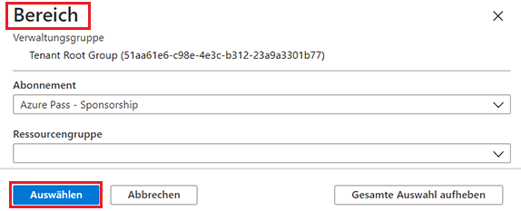
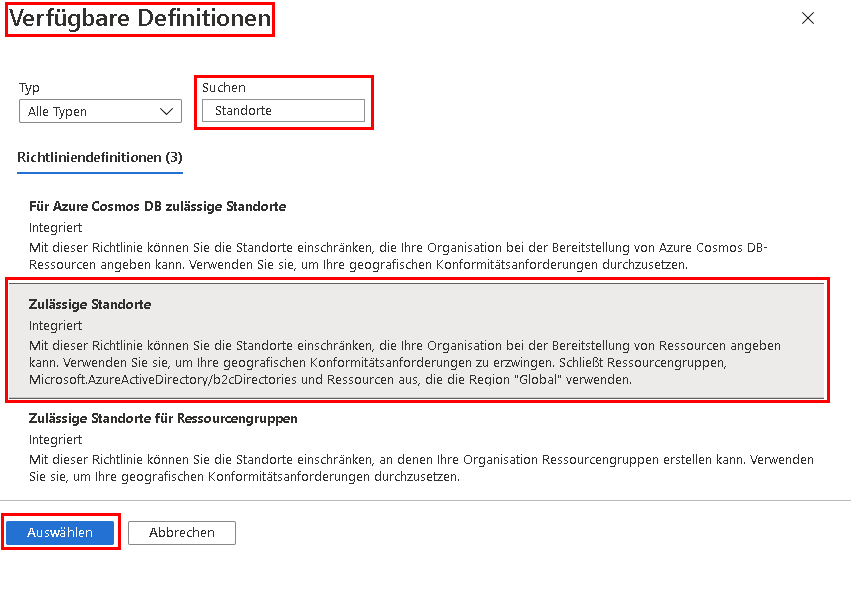
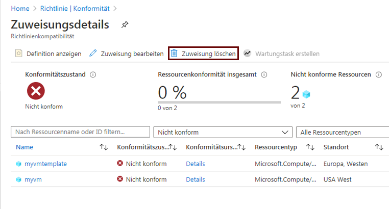

---
wts:
  title: 17 – Erstellen einer Azure-Richtlinie (10 Min.)
  module: 'Module 05: Describe identity, governance, privacy, and compliance features'
---
# 17 – Erstellen einer Azure-Richtlinie (10 Min.)

In dieser exemplarischen Vorgehensweise erstellen wir eine Azure-Richtlinie, um die Bereitstellung von Azure-Ressourcen auf einen bestimmten Standort zu beschränken.

# Aufgabe 1: Erstellen einer Richtlinienzuweisung 

In dieser Aufgabe konfigurieren wir die zulässige Standortrichtlinie und weisen sie unserem Abonnement zu. 

1. Melden Sie sich beim [Azure-Portal](https://portal.azure.com) an.

2. Suchen Sie auf dem Blatt **Alle Dienste** nach **Richtlinie**, und wählen Sie sie diese Option aus. Klicken Sie im Abschnitt **Dokumenterstellung** auf **Definitionen**.  Nehmen Sie sich einen Moment Zeit, um die Liste der integrierten Richtliniendefinitionen zu überprüfen. Wählen Sie zum Beispiel in der Dropdownliste **Kategorie** nur **Compute** aus. Mit der Definition **Zulässige SKUs für virtuelle Computer** können Sie eine Reihe von SKUs für virtuelle Computer angeben, die Ihre Organisation bereitstellen kann.

3. Wechseln Sie zurück zur Seite **Richtlinie**, und klicken Sie im Abschnitt **Dokumenterstellung** auf **Aufgaben**. Eine Zuweisung ist eine zugewiesene Richtlinie, die innerhalb eines bestimmten Bereichs angewendet werden soll. Beispielsweise könnte dem Abonnementbereich eine Definition zugewiesen werden. 

4. Klicken Sie auf **Richtlinie zuweisen** im oberen Bereich der Seite **Richtlinie - Aufgaben**.

5. Behalten Sie auf der Seite **Richtlinie zuweisen** den Standardbereich bei.

      | Einstellung | Wert | 
    | --- | --- |
    | Bereich| **Standarddaten verwenden**|
    | Richtliniendefinition | Klicken Sie auf die Auslassungspunkte, suchen Sie nach **Zulässige Standorte**, und **wählen Sie die Option aus**. |
    | Zuweisungsname | **Zulässige Standorte** |
    
    
6. Wählen Sie auf der Registerkarte **Parameter** die Option **Japan, Westen** aus. Klicken Sie auf **Überprüfen + erstellen** und dann auf **Erstellen**.

    **Hinweis:** Ein Bereich bestimmt, für welche Ressourcen oder Gruppen von Ressourcen die Richtlinienzuweisung gilt. In unserem Fall könnten wir diese Richtlinie einer bestimmten Ressourcengruppe zuweisen. Wir haben uns jedoch dafür entschieden, die Richtlinie auf Abonnementebene zuzuweisen. Beachten Sie, dass Ressourcen basierend auf der Bereichskonfiguration ausgeschlossen werden können. Ausschlüsse sind optional.

    **Hinweis:** Die Richtliniendefinition **Zulässige Standorte** gibt einen Speicherort an, an dem alle Ressourcen bereitgestellt werden müssen. Wenn ein anderer Speicherort ausgewählt wird, ist die Bereitstellung nicht zulässig. Weitere Informationen finden Sie auf der Seite [Azure Policy-Beispiele](https://docs.microsoft.com/en-us/azure/governance/policy/samples/index).

   

9. Die Richtlinienzuweisung **Zulässige Standorte** ist jetzt auf der Liste **Richtlinie - Aufgaben** aufgeführt und in Kraft getreten und setzt die Richtlinie auf der von uns angegebenen Bereichsebene (Abonnementebene) durch.

# Aufgabe 2: Testen der Richtlinie für zulässige Standorte

In dieser Aufgabe testen wir die Richtlinie für zulässige Standorte. 

1. Suchen Sie im Azure-Portal auf dem Blatt **Alle Dienste** nach **Speicherkonten**, und wählen Sie diese Option aus. Klicken Sie anschließend auf **+ Erstellen**.

2. Konfigurieren Sie das Speicherkonto (ersetzen Sie **xxxx** im Namen des Speicherkontos durch Buchstaben und Ziffern, sodass der Name global eindeutig ist). Belassen Sie ansonsten die Standardeinstellungen. 

    | Einstellung | Wert | 
    | --- | --- |
    | Subscription | **Standarddaten verwenden** |
    | Resource group | **myRGPolicy** (neu erstellen) |
    | Speicherkontoname | **storageaccountxxxx** |
    | Standort | **(USA) USA, Osten** |

3. Klicken Sie auf **Überprüfen + erstellen** und dann auf **Erstellen**. 

4. Sie erhalten die Fehlermeldung **Bereitstellung fehlgeschlagen**, die besagt, dass die Ressource von der Richtlinie nicht zugelassen wurde, einschließlich des Richtliniennamens **Zulässige Standorte**.

# Aufgabe 3: Löschen der Richtlinienzuweisung

In dieser Aufgabe entfernen wir die Richtlinienzuweisung für zulässige Standorte und testen dies. 

Wir werden die Richtlinienzuweisung löschen, um sicherzustellen, dass wir bei zukünftigen Arbeiten, die wir ausführen möchten, nicht blockiert werden.

1. Suchen Sie auf dem Blatt **Alle Dienste** nach **Richtlinie**, und wählen Sie diese Option aus. Klicken Sie anschließend auf Ihre Richtlinie **Zulässige Standorte**.

    **Hinweis:** Auf dem Blatt **Richtlinie** können Sie den Konformitätszustand der verschiedenen Richtlinien anzeigen, die Sie zugewiesen haben.

    **Hinweis:** Mit der Richtlinie „Zulässiger Standort“ werden möglicherweise nicht konforme Ressourcen angezeigt. In diesem Fall handelt es sich um Ressourcen, die vor der Richtlinienzuweisung erstellt wurden.
 
2. Klicken Sie auf **Zulässige Standorte**. Daraufhin wird Fenster für die Richtlinieneinhaltung der zulässigen Standorte geöffnet.

3. Klicken Sie im obersten Menü auf **Zuweisung löschen**. Bestätigen Sie, dass Sie die Richtlinienzuweisung löschen möchten, indem Sie auf **Ja** klicken.

   

4. Versuchen Sie, ein anderes Speicherkonto zu erstellen, um sicherzustellen, dass die Richtlinie nicht mehr gültig ist.

    **Hinweis:** Häufige Szenarien, in denen die Richtlinie **Zulässige Standorte** nützlich sein kann, wären: 
    - *Kostenverfolgung*: Sie können unterschiedliche Abonnements für unterschiedliche regionale Standorte haben. Die Richtlinie wird sicherstellen, dass alle Ressourcen in der vorgesehenen Region bereitgestellt werden, um die Kostenverfolgung zu unterstützen. 
    - *Compliance mit Datenresidenz- und Sicherheitsanforderungen*: Sie können auch Anforderungen an die Datenresidenz haben und Abonnements pro Kunde oder bestimmten Workloads erstellen und festlegen, dass alle Ressourcen in einem bestimmten Rechenzentrum bereitgestellt werden müssen, um die Complianceanforderungen bezüglich Daten und Sicherheit zu erfüllen.

Glückwunsch! Sie haben eine Azure-Richtlinie erstellt, die die Bereitstellung von Azure-Ressourcen auf ein bestimmtes Rechenzentrum beschränkt.

**Hinweis:** Um zusätzliche Kosten zu vermeiden, können Sie diese Ressourcengruppe bei Bedarf entfernen. Suchen Sie nach Ressourcengruppen, klicken Sie auf Ihre Ressourcengruppe und dann auf **Ressourcengruppe löschen**. Überprüfen Sie den Namen der Ressourcengruppe und klicken Sie dann auf **Löschen**. Überwachen Sie die **Benachrichtigungen**, um zu sehen, wie der Löschvorgang abläuft.
