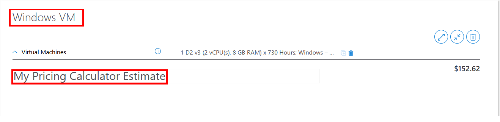
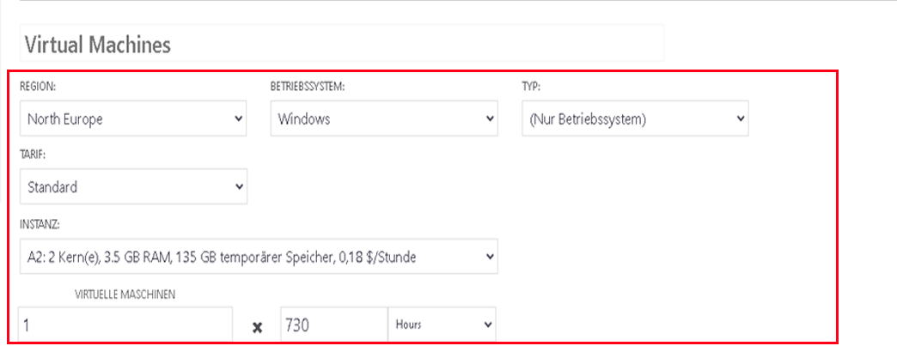
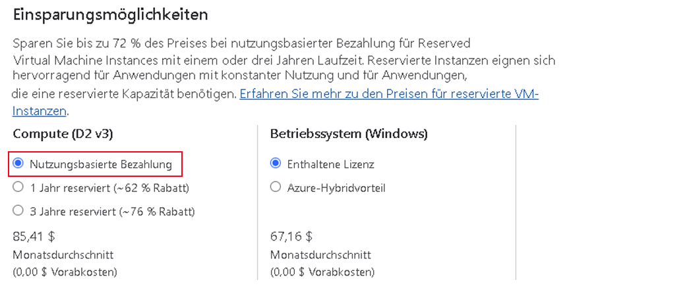
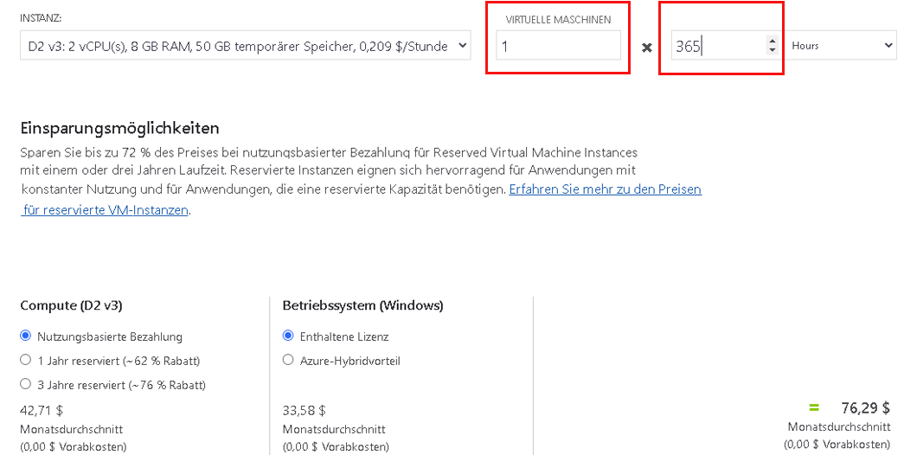
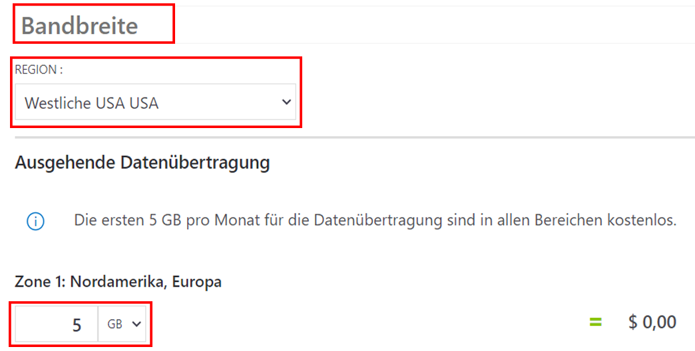
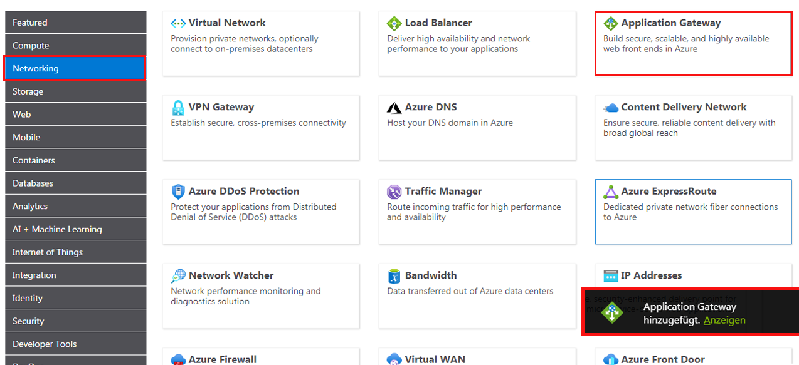

---
wts:
  title: 19 – Verwenden des Azure-Preisrechners (10 Min.)
  module: 'Module 06: Describe Azure cost management and service level agreements'
---
# 19 – Verwenden des Preisrechners (10 Min.)

In dieser exemplarischen Vorgehensweise verwenden wir den Azure-Preisrechner, um einen Kostenvoranschlag für einen virtuellen Azure-Computer und zugehörige Netzwerkressourcen zu erstellen.

# Aufgabe 1: Konfigurieren des Preisrechners

In dieser Aufgabe schätzen wir die Kosten einer Infrastruktur-Stichprobe mithilfe des Azure-Preisrechners ab. 

<bpt id="p1">**</bpt>Note<ept id="p1">**</ept>: To create an Azure Pricing Calculator estimate, this walkthrough provides example configurations for the VM and related resources. Use this example configurations or provide the Azure Pricing Calculator with details of your <bpt id="p1">*</bpt>actual<ept id="p1">*</ept> resource requirements instead.

1. Navigieren Sie in einem Browser zur Webseite mit dem [Azure-Preisrechner](https://azure.microsoft.com/en-us/pricing/calculator/).

2. Klicken Sie auf der Registerkarte **Produkte** auf **Virtual Machines**, um Details zu Ihrer Konfiguration des virtuellen Computers hinzuzufügen. Scrollen Sie nach unten, um die Details des virtuellen Computers anzuzeigen. 

3. Replace <bpt id="p1">**</bpt>Your Estimate<ept id="p1">**</ept> and <bpt id="p2">**</bpt>Virtual Machines<ept id="p2">**</ept> text with more descriptive names for your Azure Pricing Calculator estimate and your VM configuration. This walkthrough example uses <bpt id="p1">**</bpt>My Pricing Calculator Estimate<ept id="p1">**</ept> for the estimate, and <bpt id="p2">**</bpt>Windows VM<ept id="p2">**</ept> for the VM configuration.

   

4. Ändern Sie die Standardkonfiguration des virtuellen Computers.

    | Einstellungen | Wert |
    | -- | -- |
    | Region | **Europa, Norden** |
    | Betriebssystem | **Windows** |
    | Typ | **(Nur Betriebssystem)** |
    | Tarif | **Standard** |  
    | Instanz | **A2: 2 Kerne, 3,5 GB RAM, 135 GB temporärer Speicher** |

   

    <bpt id="p1">**</bpt>Note<ept id="p1">**</ept>: The VM instance specifications and pricing may differ from those in this example. Follow this walkthrough by choosing an instance that matches the example as closely as possible. To view details about the different VM product options, choose <bpt id="p1">**</bpt>Product details<ept id="p1">**</ept> from the <bpt id="p2">**</bpt>More info<ept id="p2">**</ept> menu on the right.

5. Legen Sie **Abrechnungsoption** auf **Vorausbezahlung** fest.

   

6. **Hinweis:** Um eine Azure-Preisrechnerschätzung zu erstellen, enthält diese exemplarische Vorgehensweise Beispielkonfigurationen für den virtuellen Computer und die zugehörigen Ressourcen.

    Belassen Sie die Anzahl der virtuellen Computer auf `1`, und ändern Sie den Wert für Stunden pro Monat in `365`.

   

7. Ändern Sie im Bereich **Verwaltete BS-Datenträger** die standardmäßige VM-Speicherkonfiguration.

    | Tarif | Datenträgergröße | Anzahl der Datenträger | Snapshot | Speichertransaktionen |
    | ---- | --------- | --------------- | -------- | -------------------- |
    | HDD Standard | S30: 1024 GiB | 1 | Aus | 10.000 |

   

8. To add networking bandwidth to your estimate, go to the top of the Azure Pricing Calculator webpage. Click <bpt id="p1">**</bpt>Networking<ept id="p1">**</ept> in the product menu on the left, then click the <bpt id="p2">**</bpt>Bandwidth<ept id="p2">**</ept> tile. In the <bpt id="p1">**</bpt>Bandwidth added<ept id="p1">**</ept> message dialog, click <bpt id="p2">**</bpt>View<ept id="p2">**</ept>.

   

9. Ersetzen Sie den Text **Ihre Schätzung** und **Virtuelle Computer** durch aussagekräftigere Namen für Ihre Azure-Preisrechnerschätzung und Ihre VM-Konfiguration.

    | Region | Betrag für ausgehende Datenübertragung in Zone 1 |
    | ------ | -------------------------------------- |
    | Nordeuropa | 50 GB |

   

10. To add an Application Gateway, return to the top of the Azure Pricing Calculator webpage. In the <bpt id="p1">**</bpt>Networking<ept id="p1">**</ept> product menu, click the <bpt id="p2">**</bpt>Application Gateway<ept id="p2">**</ept> tile. In the <bpt id="p1">**</bpt>Application Gateway<ept id="p1">**</ept> message dialog, click <bpt id="p2">**</bpt>View<ept id="p2">**</ept>.

    

11. Der hervorgehobene Schätzungsname und der Konfigurationsname des virtuellen Computers geben an, wie ein Schätzungsname und ein Konfigurationsname für den virtuellen Computer zu einer Schätzung des Azure-Preisrechners hinzugefügt werden.

    | Einstellungen | Wert |
    | -- | -- |
    | Region | **Europa, Norden** |
    | Tarif | **Grundlegend** |
    | Size | **Klein** |
    | Instanzen | **1** |  
    | Stunden | **365** |
    | Verarbeitete Datenmenge | **50 GB** |
    | Zone 1: Nordamerika, Europa | **50 GB**|

    

# Aufgabe 2: Überprüfen der Preisschätzung

In dieser Aufgabe werden die Ergebnisse des Azure-Preisrechners überprüft. 

1. Scrollen Sie zum Ende der Azure-Preisrechner-Webseite, um die Gesamtsumme der **Geschätzten monatlichen Kosten** anzuzeigen.

    <bpt id="p1">**</bpt>Note<ept id="p1">**</ept>: Explore the various options available within the Azure Pricing Calculator. For example, this walkthrough requires you to update the currency to Euro.

2. Ändern Sie die Währung in Euro und wählen Sie dann **Export**, um eine Kopie des Kostenvoranschlags für die Offline-Anzeige im Microsoft Excel-Format (`.xlsx`) herunterzuladen.

    

    

Congratulations! You downloaded an estimate from the Azure Pricing Calculator.
